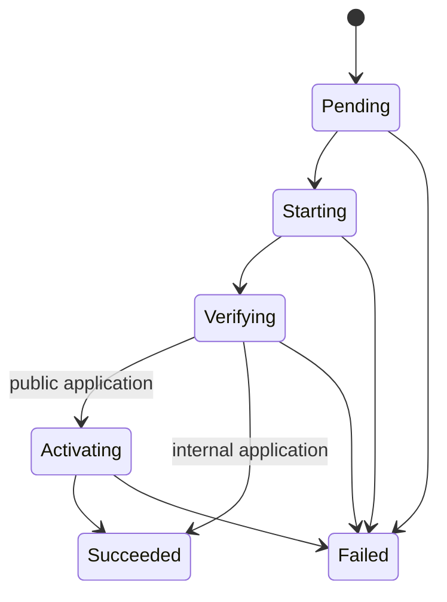

# Pneuma Architecture

**Status:** living document - describes the system as implemented.

## 1. Structure

Single crate organized into three layers:

- `src/main.rs` - thin CLI with argument parsing via clap derive; composes
  configuration and calls use cases; contains no domain logic.
- `src/domain/` - pure domain types (`application`, `manifest`, `release`,
  `system`), with no external dependencies.
- `src/use_cases/` - use cases that orchestrate adapters and domain
  (`application_import`, `application_list`, `application_runtime`,
  `ci_dispatch`, `deployment_activate_public`, `deployment_create`,
  `deployment_deploy_branch`, `deployment_deploy_oci`,
  `deployment_deploy_release`, `deployment_list`, `deployment_progress`,
  `deployment_promote_internal`, `deployment_promote_public`,
  `deployment_register_runtime`, `deployment_rollback`,
  `deployment_runtime_cleanup`, `deployment_start_candidate`,
  `deployment_transition`, `exposure_change`, `release_create`, `system_create`,
  `system_list`, `system_show`).
   `deployment_deploy_release` orchestrates the entire deployment (runtime, health,
   Caddy, and activation) from an immutable Release; supporting responsibilities
   were extracted into cohesive modules (`deployment_progress` for reporting,
   `deployment_runtime_cleanup` for removing old candidates and runtimes,
   `deployment_start_candidate` for creating the candidate runtime, and
   `deployment_activate_public` for public activation). The OCI path
   (`deployment_deploy_oci`) produces the Release and delegates to it. The Git-aware
   path (`deployment_deploy_branch`) resolves branch → commit → image tag → digest and
   delegates to `deployment_deploy_oci`.
   `deployment_transition` applies the persisted state machine.
   `ci_dispatch` is the restricted SSH dispatcher (forced command) that accepts only
   `deploy <app> <branch>` and `version`.
- `src/adapters/` - integrations with external systems (`git_source`,
  `local_runtime`, `oci_image`, `port_allocator`,
  `systemd_quadlet`, `caddy_exposure`, `health_check_external`,
  `health_check_internal`, `stores`, `database`).

No traits, generics, macros, or async: the constraints in
[`docs/rust-guidelines.md`](../rust-guidelines.md) apply to every change.

> **v0.2 complete** (see [`roadmap.md`](../roadmap.md)): Pneuma now operates
> in Git-aware mode. The only deployable artifact is `image@digest`, discovered
> by CI (`Git branch → commit → OCI digest`). Persistence is organized into
> SQLite stores by capability. Phase A removed `deploy-source`,
> `deployment_deploy_source`, `local_build`, and `[build]`. Phase H validated
> the complete flow with the pilot application `vitoralmeida.tech` in staging and
> production. Bootstrap, VM, and E2E operational hardening completed after v0.2;
> this document describes the current implemented architecture before v0.3
> reconciliation.

## 2. External effects

Every integration is a child process with structured arguments, without a shell:
`git`, `podman` (rootless), `systemctl --user`, `caddy`, `curl`, and `df`. Pneuma
has no daemon or control plane of its own: every CLI invocation composes
everything in the local process and exits. Persistent container supervision is
handled by the systemd user manager through Quadlet.

## 3. Persistence

SQLite (bundled rusqlite) is the only persistence layer. Versioned, immutable
migrations live in `migrations/` and are registered through `include_str!` in
`src/adapters/database.rs`, which applies pending migrations whenever a connection
opens (`PRAGMA foreign_keys = ON`).

The application specification is persisted when importing `pneuma.toml`
(schema v3): `application_sources` exists when the import provides
`repository_url` (it comes from the command, not the manifest), and
`application_delivery_specs` always stores the permitted OCI repository
(`[delivery] image`), used to validate `app deploy --image`.

`pneuma app import` accepts only Git URLs (local paths are rejected;
`file://` is used for local test repositories). Import temporarily clones the
repository, reads `pneuma.toml`, persists the application, and removes the
checkout; it does not deploy.

Rules observed:

- short transactions, never kept open during Git, build, Podman, Caddy, or HTTP;
- intent persisted before effects; completion persisted after confirming the
  effect (local saga, without a distributed transaction);
- public promotion (the active deployment runtime, deployment `succeeded`, and
  exposure `active`) occurs in a single transaction;
- the database is not the source of observed runtime state; Podman is.

`runtime_port_reservations` (migration 0012) prevents concurrent candidates
from receiving the same loopback port. The reservation exists before the runtime
is registered, is consumed after registration, and is released during candidate cleanup.

Backup and restore use the SQLite backup API. Restore validates
`PRAGMA integrity_check`, takes an exclusive `<database>.restore.lock`,
preserves a `pre-restore` copy, replaces the database through an atomic rename,
and removes WAL sidecars before the next open.

All paths come from environment variables (`PNEUMA_DATABASE_PATH`,
`PNEUMA_WORKSPACE_PATH`, `PNEUMA_CADDY_MANAGED_PATH`, `PNEUMA_CADDYFILE_PATH`,
`PNEUMA_RUNTIME_PORT_RANGE`, `PNEUMA_QUADLET_DIR`), with defaults under
`/var/lib/pneuma`, `/etc/caddy`, `30000-39999`, and
`$HOME/.config/containers/systemd`.

The Pneuma environment is decoupled from the login shell: bootstrap writes the
variables to `/etc/pneuma/environment` (read by the binary) and to the
`~/.profile` of the `pneuma` user.

## 4. Runtime

- each deployment generates a Quadlet unit
  `pneuma-<application>-<deployment-id>.container` and a container with the same
  name, with application labels and image digest
  (`io.pneuma.image-digest`); legacy Quadlets with `io.pneuma.revision` remain
  operable until redeployment;
- publication is restricted to loopback:
  `127.0.0.1:<reserved-port>:<container_port>`; the fixed port is the lowest
  free port in `PNEUMA_RUNTIME_PORT_RANGE`, and the candidate is never publicly
  reachable;
- no privileged mode, arbitrary mounts, or access to the Podman socket;
- the unit has `Restart=on-failure`; it starts the candidate but is enabled only
  after promotion, so only the current runtime returns after reboot.

The creation path is: reserve port → write unit → `systemctl --user
daemon-reload` → start unit → resolve the container ID by name. Failure at any
step cleans up the unit, container, candidate runtime, and reservation whenever
they already exist.

After a successful transactional promotion, Pneuma enables the current unit and
attempts to remove the previous runtime (stop, disable, remove unit,
daemon-reload, remove container, and `removed_at`). This finalization is best-effort:
an error emits a warning without reverting the already completed promotion.

### 4.1 Runtime lifecycle

- deployment promotion sets `applications.desired_runtime_state` to `running`,
  persisting intent together with activation;
- `app status` observes the active deployment container (`active_deployment_id`)
  in Podman and records the observation: `last_observed_state`, `last_observed_at`,
  and, when running, `host_port`; if the container is absent, it records
  `missing` without `removed_at`, preserving the RuntimeInstance for recovery;
- `app stop` and `app start` persist the desired state before the external effect,
  control the Quadlet unit, and persist the resulting observation (local saga);
  a legacy runtime without a Quadlet file uses `podman start`/`podman stop` until
  redeployed; `app start` recovers an absent container through the Quadlet unit
  when it still exists;
- stopping an already stopped application and starting an already running one are
  idempotent successes;
- a registered but never deployed application, and an unknown name, fail before
  any external effect.

## 5. Caddy exposure

Public applications are published through `<application-id>.caddy` fragments in
the managed directory, imported by the main `Caddyfile`:

1. persist `desired_visibility` and `materialization_state=applying` before
   materializing the route;
2. generate the fragment in a temporary file on the same filesystem;
3. run `caddy validate` against the complete `Caddyfile`;
4. atomically rename, `caddy reload`, and perform an external health check;
5. finalize as `active` only after all effects are confirmed; a failure restores
   and reloads the previous fragment; if recovery fails, exposure becomes
   `diverged` for manual inspection.

To make an application internal, Pneuma persists `Internal/removing` before
removing the route. After removal and reload, it finalizes as `not_materialized`;
if subsequent persistence fails, it records `diverged` because the route has
already changed.

`exposures.configuration_version` stores the canonical fragment content
(`domain` and loopback endpoint), not the Release or Deployment.

## 6. Health check

- **internal:** HTTP on the candidate loopback endpoint, before any traffic
  switch;
- **external (public):** `curl` at `https://<domain><path>` with
  `--resolve <domain>:443:127.0.0.1`, checking the local Caddy listener with
  retries.

## 7. Deployment state machine

Every `Failed` state persists a code, stage, and message; the candidate is
removed and the previous Release (route and runtime) is preserved. Only one
active deployment per application is permitted (`create_deployment`). Rollback
creates a new deployment (`type = rollback`) from the previous successful Release.

## 8. Operations and diagnostics

- `pneuma database backup <path>` creates a consistent SQLite copy;
  `pneuma database restore <path>` performs the recovery described in the
  persistence section before opening the normal CLI connection;
- `pneuma doctor` checks the database, migrations, paths, availability of Git,
  Podman, and Caddy, a functioning rootless Podman, Caddyfile validation, pulls
  of active OCI images, and at least 1 GiB free on the database and workspace
  filesystems;
- bootstrap enables linger for the `pneuma` user, allowing user-level Quadlet
  units to start after reboot without an active SSH session.
