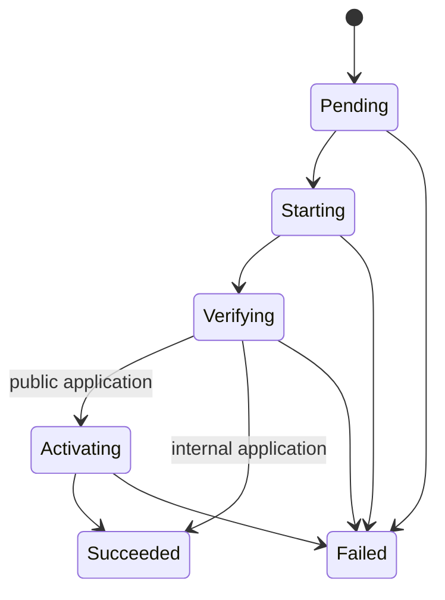

# Pneuma Architecture

**Status:** living document - describes the system as implemented in v0.3.1.

Pneuma is a single-host deployment CLI. It imports application specifications
from Git repositories, deploys immutable OCI artifacts with rootless Podman and
systemd Quadlet, and exposes public applications through Caddy. It has no daemon
or control plane: each CLI invocation runs locally and exits; systemd supervises
promoted runtimes afterward.

This document describes implemented behavior. The detailed persisted schema is
in [`data-model.md`](data-model.md). Future v0.4 reconciliation behavior is
specified separately in [`../design/reconciliation.md`](../design/reconciliation.md).

## How to Read This Document

Read [`system-context.md`](system-context.md) for motivation, scope, and
constraints; [`../decisions/`](../decisions/) for architectural rationale;
[`data-model.md`](data-model.md) for persisted semantics; and
[`security-model.md`](security-model.md) for trust boundaries. This document
answers how the current implementation works.

## Overview

Pneuma has a short-lived invocation path and a long-lived runtime path.

```text
Pneuma invocation -> evaluate SQLite intent -> controlled external effects
                  -> persist confirmed result -> exit

systemd -> Quadlet-generated service -> rootless Podman -> application
```

The invocation path makes deployment, lifecycle, and routing decisions. SQLite
records logical intent before external effects and confirmed results afterward.
The runtime path owns process survival after the invocation exits. Public Caddy
routes are a separate materialization path from the loopback runtime.

Pneuma has no resident control plane or daemon. Calling the first path a
"command plane" is useful shorthand only; it is not a continuously available
controller.

## Responsibilities

| Layer | Owns | Does not own |
|---|---|---|
| `src/main.rs` | CLI parsing, host configuration, temporary import checkout preparation, and use-case dispatch | Domain decisions or persistence rules |
| `src/domain/` | Domain entities, closed state sets, manifest parsing and validation | External effects or SQL |
| `src/use_cases/` | Business decisions, effect ordering, short transaction boundaries, and compensation | SQL mapping or process invocation details |
| `src/adapters/stores/` | SQL, row-to-domain mapping, migrations, and compare-and-set writes | Deployment policy or external effects |
| Other `src/adapters/` modules | Git, OCI, Podman, systemd Quadlet, Caddy, health, ports, filesystem, and diagnostics | Logical identity and workflow decisions |

The project uses concrete synchronous Rust code. The constraints in
[`docs/rust-guidelines.md`](../rust-guidelines.md) apply to every change.

## Domain Roles

| Concept | Role |
|---|---|
| System | Organizational grouping for Applications. Import requires a selected System and creates it when it does not already exist. |
| Application | Durable command-facing identity and desired runtime state. It owns the imported specification, Releases, Deployment history, and exposure intent. |
| Manifest | Import-time desired specification. It supplies delivery, runtime, health, and exposure configuration; the repository URL and manifest path come from the import command. |
| Release | Reusable immutable OCI artifact for one Application, identified by image digest. |
| Deployment | One attempt to activate a Release, including its type, status, source revision, and failure evidence. |
| RuntimeInstance | Logical record of the concrete runtime materialized by a Deployment, including its loopback endpoint and last observed state. |
| Exposure | Persisted visibility intent and the confirmed materialization state of its Caddy route. |

Logical identifiers are distinct from external identifiers. `active_deployment_id`
identifies a successful Deployment, not a container. A RuntimeInstance identifies
the logical materialization; its Podman container ID can change when Quadlet
recreates the container. The deterministic base name is
`pneuma-<application>-<deployment-id>`: the Podman container uses the base name,
the Quadlet file uses `<base>.container`, and systemd controls `<base>.service`.

## Authority and Persistence

| System | Authority |
|---|---|
| SQLite | Desired intent, imported specification, logical identities, deployment history, and last confirmed results. |
| Podman and systemd | Observed container and Quadlet state. |
| Caddy | Materialized public fragments, reload state, and route behavior. |
| Git | Requested branch resolution to a fixed commit. |
| OCI registry | Availability and digest of the requested artifact. |

SQLite is bundled through rusqlite. Immutable migrations in `migrations/` are
registered in `src/adapters/database.rs` and are applied when a connection opens
with foreign keys enabled. See [`data-model.md`](data-model.md) for entities,
relationships, state values, and database invariants.

Multiple authorities are intentional: persisted intent and observed external
reality are different categories of state. SQLite does not prove that an
external resource still exists. Rationale:
[`ADR-0004`](../decisions/0004-sqlite-intent-vs-runtime-authority.md).

Use cases follow a local saga model:

- transactions are short and never remain open during Git, OCI, Podman, systemd,
  Caddy, or HTTP work;
- intent is persisted before an external effect, and confirmed completion is
  persisted after observing that effect;
- a zero-row compare-and-set write is a stale or concurrent state, never success;
- public promotion atomically records the active Deployment, active runtime,
  succeeded Deployment, and active Exposure;
- external state is observed from its authority rather than inferred solely from
  the database.

All configurable paths and ports use `PNEUMA_DATABASE_PATH`,
`PNEUMA_WORKSPACE_PATH`, `PNEUMA_CADDY_MANAGED_PATH`,
`PNEUMA_CADDYFILE_PATH`, `PNEUMA_RUNTIME_PORT_RANGE`, and
`PNEUMA_QUADLET_DIR`, with host defaults described in the getting-started guide.

## Cross-Cutting Invariants

1. An active Deployment is terminal and succeeded.
2. A failed candidate never replaces the prior active runtime or public route.
3. Release identity is an immutable OCI digest; mutable tags never become a
   Release identity.
4. Rollback creates a new Deployment and preserves history.
5. Application runtime ports remain bound to loopback, including public
   Applications.
6. systemd and Quadlet own long-lived runtime supervision after Pneuma exits.
7. Persisted desired state is not treated as a current runtime observation.
8. SQLite transactions do not remain open during Git, OCI, Podman, systemd,
   Caddy, or HTTP effects.
9. CI's deployment key reaches only the restricted dispatcher, not an arbitrary
   CLI command or interactive shell.
10. A zero-row compare-and-set update is stale or concurrent state, never
    successful persistence.

Rationale for these boundaries is in [`../decisions/`](../decisions/) and
[`security-model.md`](security-model.md).

## Business Rules

### Import and manifest

- Import requires a Git URL plus a System from `--system` or `[system].name`.
  The command-line System takes precedence; Pneuma creates the selected System
  when absent.
- Manifests use schema version `3` and reject unknown fields. System and
  Application names are 1-63 lowercase ASCII letters, digits, or hyphens, with
  alphanumeric first and last characters.
- Delivery is OCI-only. Its image value is a repository, not a digest reference,
  and must not contain surrounding whitespace.
- Runtime configuration requires a nonzero container port, an absolute
  whitespace-free health path, and an expected HTTP status from 100 through 599.
  Public default visibility requires a valid domain.
- Import is create-only. Once an Application exists, a repeated import returns
  it without rewriting its stored specification.

### Artifact and deployment

- A deployed artifact is always an `image@digest`; mutable tags are rejected.
- An Application permits only the OCI repository recorded from its manifest.
- The CLI deploy input resolves a branch or Git tag to a commit, then resolves
  `commit -> repository:<commit-sha> -> digest`.
  If CI has not published that artifact, deployment fails; Pneuma never falls
  back to `latest`, a prior artifact, or a local build.
- The `(application, digest)` pair identifies a reusable Release. Source
  revision belongs to Deployment because one artifact can be activated from
  different requests. Rationale:
  [`ADR-0006`](../decisions/0006-release-deployment-runtime-model.md).
- Only one non-terminal Deployment may exist for an Application. Rollback creates
  a new `rollback` Deployment for a historical successful Release; it never edits
  prior history.
- A normal deployment rejects a Release that is already active with a live
  runtime. Rollback remains a new Deployment even when it reuses a prior Release.
- Candidate failure persists a code, stage, and message, cleans resources proven
  to belong to that candidate, and preserves the prior active runtime and route.

### Runtime

- Every candidate reserves a unique loopback port before runtime registration.
  Its endpoint is `127.0.0.1:<reserved-port>:<container-port>` and is not
  directly public. The persisted reservation is consumed once the runtime is
  registered and released when a failed candidate is cleaned up.
- Candidate creation writes the Quadlet unit, reloads the user manager, starts
  the unit, resolves its container, and registers the RuntimeInstance.
- Candidate creation starts its generated Quadlet unit before health checks and
  promotion. Units use `Restart=on-failure`; current implementation does not
  enable units through `systemctl --user enable`. Their Quadlet content includes
  `WantedBy=default.target`; with user linger, generated units can return after a
  host reboot. Rationale:
  [`ADR-0003`](../decisions/0003-rootless-podman-and-quadlet.md).
- Promotion sets desired runtime intent to `running`. `app start` and `app stop`
  persist intent before controlling the runtime and persist the resulting
  observation afterward.
- Stopping an already stopped Application and starting an already running one are
  idempotent successes. A missing container after a Quadlet stop is recorded as
  stopped without marking the RuntimeInstance removed; a start can recreate it
  through its still-present Quadlet unit.
- After promotion, retirement of the prior runtime is best effort. A retirement
  error warns without undoing the completed promotion.

### Visibility and routing

- `desired_visibility` is operator intent; `materialization_state` records the
  confirmed Caddy result. Changing intent alone does not make a route active.
- Materializing public visibility requires a configured domain, an active running
  runtime, Caddy validation and reload, and a successful external health check.
  Stopping a public Application does not remove its existing Caddy fragment.
- Internal visibility removes only the managed Caddy route. It leaves the
  loopback runtime running. Rationale:
  [`ADR-0005`](../decisions/0005-caddy-for-public-exposure.md).
- The bootstrap-managed Caddy baseline returns generic HTTP `404 Not Found` for
  unmatched hosts. HTTPS can fail during TLS before this fallback when no
  certificate exists for the hostname.
- Materialization failures attempt to restore the previous fragment and record
  `failed`; incomplete compensation records `diverged` for manual inspection.
  A persistence failure can prevent either state from being confirmed.
- Repeating a visibility request that already matches desired visibility succeeds
  without inspecting or retrying its materialization state.

## Command Data Flows

### Import

```text
Git URL + manifest path
  -> temporary checkout
  -> parse and validate pneuma.toml
  -> resolve or create System from --system or [system]
  -> SQLite transaction: System, Application, specification, Exposure
  -> remove checkout
```

`pneuma app import` accepts Git URL syntax, including `file://`; local paths are
rejected. It creates no Deployment and leaves runtime intent stopped.

### Deploy by branch or digest

```text
--branch: Application source -> Git branch or tag -> commit -> OCI commit tag -> digest
--image:  CLI digest reference -> allowed repository validation
both:     pull and verify OCI image -> reuse or create Release -> DeployRelease
```

Branch resolution fixes the source commit for the Deployment. OCI deployment
first verifies that the reference belongs to the Application's permitted
repository, pulls it, and creates or reuses the digest-pinned Release.

### Deploy and promote

```text
Release + Application specification
  -> create pending Deployment
  -> reserve port, create/start Quadlet candidate, observe container
  -> register RuntimeInstance
  -> internal health check
  -> public only: materialize Caddy fragment, reload, external health check
  -> transactional promotion to active successful Deployment
  -> best-effort retire prior runtime
```

Internal deployments promote after the internal health check. Public deployments
also require Caddy materialization and external health. A failed candidate is
never promoted, so the previously active runtime and public route remain in use.

### Runtime lifecycle and status

```text
start or stop
  -> persist desired state
  -> observe active RuntimeInstance
  -> control Quadlet unit when available, otherwise legacy container
  -> observe Podman again and persist observation

status
  -> load active RuntimeInstance and desired state
  -> observe Podman and reconcile changed container ID by deterministic name
  -> persist observed state
```

An Application with no successful Deployment fails before any runtime effect.
The status command reports an absent container as missing when intent is running,
but as stopped when an expected Quadlet stop removed the container.

### Visibility change

```text
public:   persist public/applying -> verify active running runtime
          -> materialize, validate, reload Caddy -> external health
          -> persist active route and runtime

internal: persist internal/removing -> remove and reload Caddy fragment
          -> persist not_materialized
```

If an effect completes but its persistence confirmation loses a compare-and-set,
Pneuma attempts route compensation and attempts to record `failed` or `diverged`
rather than claiming a successful exposure change.

### Rollback and CI dispatch

Rollback selects the most recent successful Deployment that is not active, pulls
its immutable Release if necessary, and runs the normal deployment flow as a new
`rollback` Deployment. It does not rely on the old container still existing.

The restricted SSH dispatcher parses `SSH_ORIGINAL_COMMAND` and permits only
`version` or `deploy <application> <branch-or-tag>`. It validates both arguments
and dispatches the permitted deploy command through the same source-resolution
flow. Security rationale: [`ADR-0007`](../decisions/0007-restricted-ssh-ci-interface.md)
and [`security-model.md`](security-model.md).

### Catalog and history

```text
system create -> create or return the named System
system list   -> list Systems by name
system show   -> System details and its Applications by name

app list      -> registered Applications and whether each has an active deployment
app deployments -> Deployment history with type, Release digest, source, and status
```

`system show` fails for an unknown System. `app deployments` first resolves the
Application by name; an Application with no history reports that explicitly.

## Health and Exposure Effects

Internal health uses HTTP against the candidate loopback endpoint before traffic
switches, with five bounded attempts. During public deployment, external health
uses the configured path and expected status through `curl` at
`https://<domain><path>` with `--resolve <domain>:443:127.0.0.1`. A standalone
change to public visibility instead checks `/` for HTTP `200`. External health
retries through Caddy's local listener. Public Caddy fragments are stored as
`<application-id>.caddy` files in the managed directory and imported by the main
Caddyfile.

## End-to-End Scenarios

### First Deployment

Import temporarily checks out the repository, validates `pneuma.toml`, and
persists the Application specification and Exposure intent in SQLite. Deploy by
branch resolves a Git revision, pulls `repository:<commit-sha>`, resolves the
image digest, and creates or reuses a Release. Pneuma persists a pending
Deployment, reserves a loopback port, writes and starts a candidate Quadlet
unit, then records its RuntimeInstance after observing Podman.

Internal health passes before promotion. For public intent, Pneuma additionally
materializes a Caddy fragment, reloads Caddy, and confirms external health.
Promotion transactionally records the successful Deployment, active runtime,
and active exposure. SQLite owns those logical facts; Podman/systemd own the
runtime observation and Caddy owns route behavior after Pneuma exits.

### Candidate Health Failure

With active Deployment A running, Deployment B begins as a candidate. If B fails
internal or public health, Pneuma records B as failed with diagnostic evidence,
cleans resources proven to belong to B, and releases its reservation. It does
not promote B. A remains the active Deployment and, for a public Application,
Caddy continues to route to A.

### Host Reboot

Pneuma is not running after a reboot. The promoted Quadlet file remains in the
user Quadlet directory and contains `WantedBy=default.target`; linger keeps the
`pneuma` user manager available. systemd regenerates and starts the Quadlet
service, and Podman recreates the deterministic container. Caddy starts
independently. A later `pneuma app status` observes the runtime and may update
the recorded external container ID without changing its logical identity.

## Deployment State Machine



`Pending`, `Starting`, `Verifying`, and `Activating` reserve the Application for
that Deployment. `Succeeded` and `Failed` are terminal. Deployment status
describes an activation attempt; desired runtime state separately describes what
the operator wants an active runtime to do, while Podman remains authoritative
for its observed state.

## Operations Boundary

- Bootstrap provisions host prerequisites, writes the Pneuma environment, enables
  linger for the `pneuma` user, and maintains the Caddy baseline.
- The binary updater changes only the binary; bootstrap must be rerun when a
  release changes host-managed files such as the Caddy baseline.
- `pneuma database backup <path>` makes a SQLite backup, refusing an existing
  destination. `pneuma database restore <path>` checks source integrity, takes a
  create-only `<database>.restore.lock` file, makes a pre-restore backup, and
  replaces the database atomically.
- `pneuma doctor` checks the database and migrations, configured paths, Caddy
  configuration, Git/Podman/Caddy availability, rootless Podman, the Quadlet user
  generator, disk capacity, and that active OCI images remain pullable. It does
  not establish that an individual Application is healthy.
- `pneuma version` prints the package version without opening the database.
