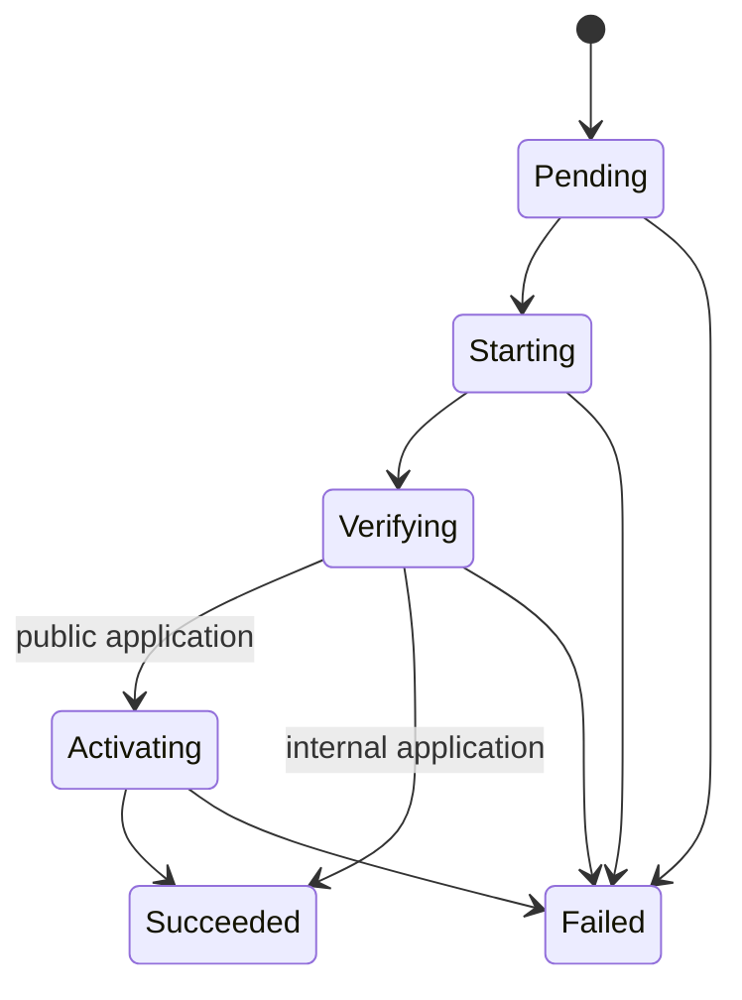

# Pneuma Architecture

**Status:** living document - describes the system as implemented in v0.3.1.

Pneuma is a single-host deployment CLI. It imports application specifications
from Git repositories, deploys immutable OCI artifacts with rootless Podman and
systemd Quadlet, and exposes public applications through Caddy. It has no daemon
or control plane: each CLI invocation runs locally and exits; systemd supervises
promoted runtimes afterward.

This document describes implemented behavior. The detailed persisted schema is
in [`data-model.md`](data-model.md). Future v0.4 reconciliation behavior is
specified separately in [`../design/reconciliation.md`](../design/reconciliation.md).

## Responsibilities

| Layer | Owns | Does not own |
|---|---|---|
| `src/main.rs` | CLI parsing, host configuration, temporary import checkout preparation, and use-case dispatch | Domain decisions or persistence rules |
| `src/domain/` | Domain entities, closed state sets, manifest parsing and validation | External effects or SQL |
| `src/use_cases/` | Business decisions, effect ordering, short transaction boundaries, and compensation | SQL mapping or process invocation details |
| `src/adapters/stores/` | SQL, row-to-domain mapping, migrations, and compare-and-set writes | Deployment policy or external effects |
| Other `src/adapters/` modules | Git, OCI, Podman, systemd Quadlet, Caddy, health, ports, filesystem, and diagnostics | Logical identity and workflow decisions |

The project uses concrete synchronous Rust code. The constraints in
[`docs/rust-guidelines.md`](../rust-guidelines.md) apply to every change.

## Domain Roles

| Concept | Role |
|---|---|
| System | Optional organizational grouping for Applications. |
| Application | Durable command-facing identity and desired runtime state. It owns the imported specification, Releases, Deployment history, and exposure intent. |
| Manifest | Import-time desired specification. It supplies delivery, runtime, health, and exposure configuration; the repository URL and manifest path come from the import command. |
| Release | Reusable immutable OCI artifact for one Application, identified by image digest. |
| Deployment | One attempt to activate a Release, including its type, status, source revision, and failure evidence. |
| RuntimeInstance | Logical record of the concrete runtime materialized by a Deployment, including its loopback endpoint and last observed state. |
| Exposure | Persisted visibility intent and the confirmed materialization state of its Caddy route. |

Logical identifiers are distinct from external identifiers. `active_deployment_id`
identifies a successful Deployment, not a container. A RuntimeInstance identifies
the logical materialization; its Podman container ID can change when Quadlet
recreates the container. Pneuma instead uses the deterministic external name
`pneuma-<application>-<deployment-id>.container` for its Quadlet unit and
container.

## Authority and Persistence

| System | Authority |
|---|---|
| SQLite | Desired intent, imported specification, logical identities, deployment history, and last confirmed results. |
| Podman and systemd | Observed container and Quadlet state. |
| Caddy | Materialized public fragments, reload state, and route behavior. |
| Git | Requested branch resolution to a fixed commit. |
| OCI registry | Availability and digest of the requested artifact. |

SQLite is bundled through rusqlite. Immutable migrations in `migrations/` are
registered in `src/adapters/database.rs` and are applied when a connection opens
with foreign keys enabled. See [`data-model.md`](data-model.md) for entities,
relationships, state values, and database invariants.

Use cases follow a local saga model:

- transactions are short and never remain open during Git, OCI, Podman, systemd,
  Caddy, or HTTP work;
- intent is persisted before an external effect, and confirmed completion is
  persisted after observing that effect;
- a zero-row compare-and-set write is a stale or concurrent state, never success;
- public promotion atomically records the active Deployment, active runtime,
  succeeded Deployment, and active Exposure;
- external state is observed from its authority rather than inferred solely from
  the database.

All configurable paths and ports use `PNEUMA_DATABASE_PATH`,
`PNEUMA_WORKSPACE_PATH`, `PNEUMA_CADDY_MANAGED_PATH`,
`PNEUMA_CADDYFILE_PATH`, `PNEUMA_RUNTIME_PORT_RANGE`, and
`PNEUMA_QUADLET_DIR`, with host defaults described in the getting-started guide.

## Business Rules

### Artifact and deployment

- A deployed artifact is always an `image@digest`; mutable tags are rejected.
- An Application permits only the OCI repository recorded from its manifest.
- Branch deployment resolves `branch -> commit -> image:<commit> -> digest`.
  If CI has not published that artifact, deployment fails; Pneuma never falls
  back to `latest`, a prior artifact, or a local build.
- The `(application, digest)` pair identifies a reusable Release. Source
  revision belongs to Deployment because one artifact can be activated from
  different requests.
- Only one non-terminal Deployment may exist for an Application. Rollback creates
  a new `rollback` Deployment for a historical successful Release; it never edits
  prior history.
- Candidate failure persists a code, stage, and message, cleans resources proven
  to belong to that candidate, and preserves the prior active runtime and route.

### Runtime

- Every candidate reserves a unique loopback port before runtime registration.
  Its endpoint is `127.0.0.1:<reserved-port>:<container-port>` and is not
  directly public.
- Candidate creation writes the Quadlet unit, reloads the user manager, starts
  the unit, resolves its container, and registers the RuntimeInstance.
- A candidate unit is enabled only after promotion, so only the active runtime
  returns after reboot. Units use `Restart=on-failure`.
- Promotion sets desired runtime intent to `running`. `app start` and `app stop`
  persist intent before controlling the runtime and persist the resulting
  observation afterward.
- Stopping an already stopped Application and starting an already running one are
  idempotent successes. A missing container after a Quadlet stop is recorded as
  stopped without marking the RuntimeInstance removed; a start can recreate it
  through its still-present Quadlet unit.
- After promotion, retirement of the prior runtime is best effort. A retirement
  error warns without undoing the completed promotion.

### Visibility and routing

- `desired_visibility` is operator intent; `materialization_state` records the
  confirmed Caddy result. Changing intent alone does not make a route active.
- Public visibility requires a configured domain, an active runtime, a running
  container, Caddy validation and reload, and a successful external health check.
- Internal visibility removes only the managed Caddy route. It leaves the
  loopback runtime running.
- The bootstrap-managed Caddy baseline returns generic HTTP `404 Not Found` for
  unmatched hosts. HTTPS can fail during TLS before this fallback when no
  certificate exists for the hostname.
- Materialization failures restore the previous fragment when possible and record
  `failed`; incomplete compensation records `diverged` for manual inspection.

## Command Data Flows

### Import

```text
Git URL + manifest path
  -> temporary checkout
  -> parse and validate pneuma.toml
  -> SQLite transaction: System, Application, specification, Exposure
  -> remove checkout
```

`pneuma app import` accepts remote Git URLs; `file://` is available for local
test repositories. It creates no Deployment and leaves runtime intent stopped.
Import is create-only: an existing Application is returned without rewriting its
stored specification.

### Deploy by branch or digest

```text
--branch: Application source -> Git branch -> commit -> OCI commit tag -> digest
--image:  CLI digest reference -> allowed repository validation
both:     pull and verify OCI image -> reuse or create Release -> DeployRelease
```

Branch resolution fixes the source commit for the Deployment. OCI deployment
first verifies that the reference belongs to the Application's permitted
repository, pulls it, and creates or reuses the digest-pinned Release.

### Deploy and promote

```text
Release + Application specification
  -> create pending Deployment
  -> reserve port, create/start Quadlet candidate, observe container
  -> register RuntimeInstance
  -> internal health check
  -> public only: materialize Caddy fragment, reload, external health check
  -> transactional promotion to active successful Deployment
  -> enable candidate unit and best-effort retire prior runtime
```

Internal deployments promote after the internal health check. Public deployments
also require Caddy materialization and external health. A failed candidate is
never promoted, so the previously active runtime and public route remain in use.

### Runtime lifecycle and status

```text
start or stop
  -> persist desired state
  -> observe active RuntimeInstance
  -> control Quadlet unit when available, otherwise legacy container
  -> observe Podman again and persist observation

status
  -> load active RuntimeInstance and desired state
  -> observe Podman and reconcile changed container ID by deterministic name
  -> persist observed state
```

An Application with no successful Deployment fails before any runtime effect.
The status command reports an absent container as missing when intent is running,
but as stopped when an expected Quadlet stop removed the container.

### Visibility change

```text
public:   persist public/applying -> verify active running runtime
          -> materialize, validate, reload Caddy -> external health
          -> persist active route and runtime

internal: persist internal/removing -> remove and reload Caddy fragment
          -> persist not_materialized
```

If an effect completes but its persistence confirmation loses a compare-and-set,
Pneuma attempts route compensation and records `failed` or `diverged` rather than
claiming a successful exposure change.

### Rollback and CI dispatch

Rollback selects the most recent successful Deployment that is not active, pulls
its immutable Release if necessary, and runs the normal deployment flow as a new
`rollback` Deployment. It does not rely on the old container still existing.

The restricted SSH dispatcher parses `SSH_ORIGINAL_COMMAND` and permits only
`version` or `deploy <application> <branch>`. It validates both arguments and
dispatches the permitted deploy command through the same branch deployment flow.

## Health and Exposure Effects

Internal health uses HTTP against the candidate loopback endpoint before traffic
switches. Public health uses `curl` at `https://<domain><path>` with
`--resolve <domain>:443:127.0.0.1`, validating Caddy's local listener with
retries. Public Caddy fragments are stored as `<application-id>.caddy` files in
the managed directory and imported by the main Caddyfile.

## Deployment State Machine



`Pending`, `Starting`, `Verifying`, and `Activating` reserve the Application for
that Deployment. `Succeeded` and `Failed` are terminal. Deployment status
describes an activation attempt; desired runtime state separately describes what
the operator wants an active runtime to do, while Podman remains authoritative
for its observed state.

## Operations Boundary

- Bootstrap provisions host prerequisites, writes the Pneuma environment, enables
  linger for the `pneuma` user, and maintains the Caddy baseline.
- The binary updater changes only the binary; bootstrap must be rerun when a
  release changes host-managed files such as the Caddy baseline.
- `pneuma database backup` and `restore` use SQLite's backup API. Restore checks
  integrity, takes an exclusive restore lock, preserves a pre-restore copy, and
  replaces the database atomically.
- `pneuma doctor` validates host dependencies and operational prerequisites. It
  does not establish that an individual Application is healthy.
