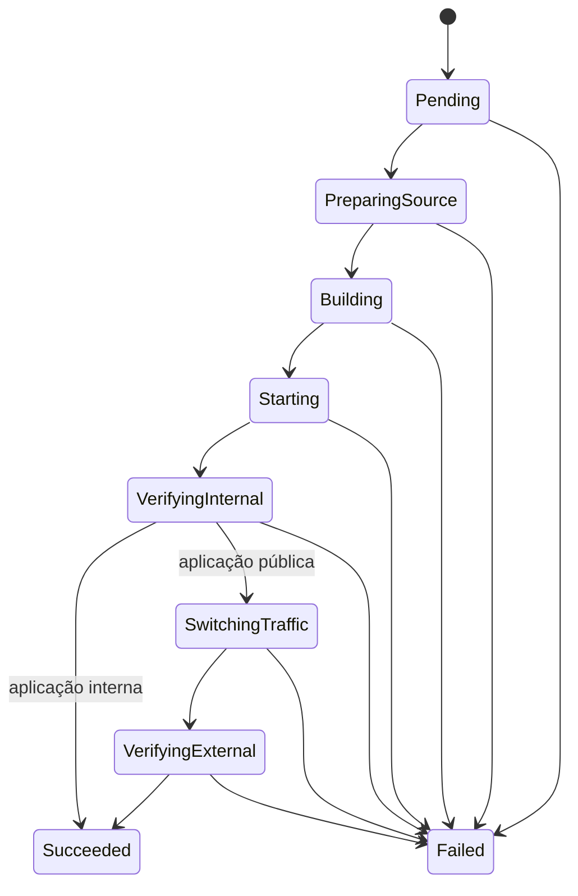

# Arquitetura do Pneuma

**Status:** documento vivo — descreve o sistema como implementado. As hipóteses
originais da Iteração D0 (ports and adapters multi-crate, TUI, Quadlet) foram
arquivadas em [`docs/archive/`](../archive/) e não devem ser usadas como
referência do comportamento atual.

## 1. Estrutura

Crate único e plano, sem camadas formais:

- `src/main.rs` — CLI fina com parsing manual de argumentos (sem clap); compõe
  configuração e chama os casos de uso; não contém lógica de domínio.
- `src/*.rs` — um módulo por caso de uso (`import_application`,
  `create_deployment`, `promote_public_candidate`, ...) ou por adapter
  (`git_source`, `local_build`, `local_runtime`, `caddy_exposure`,
  `external_health`, `database`).
- `src/deploy_internal_revision.rs` — orquestra o deployment inteiro, interno e
  público, emitindo progresso passo a passo.
- `src/transition_deployment.rs` — aplica a máquina de estados persistida.

Sem traits, generics, macros ou async: as restrições de
[`docs/rust-guidelines.md`](../rust-guidelines.md) valem para toda mudança.

## 2. Efeitos externos

Toda integração é um processo filho com argumentos estruturados, sem shell:
`git`, `podman` (rootless), `caddy`, `curl`. Não existe daemon; cada execução
da CLI compõe tudo no processo local e termina.

## 3. Persistência

SQLite (rusqlite bundled) é a única persistência. Migrations versionadas e
imutáveis vivem em `migrations/` e são registradas via `include_str!` em
`src/database.rs`, que aplica as pendentes em cada abertura de conexão
(`PRAGMA foreign_keys = ON`).

Regras observadas:

- transações curtas, nunca abertas durante Git, build, Podman, Caddy ou HTTP;
- intenção persistida antes dos efeitos; conclusão persistida após confirmar o
  efeito (saga local, sem transação distribuída);
- a promoção pública (runtime `current`, deployment `succeeded` e exposição
  `active`) acontece em uma única transação;
- o banco não é fonte do estado observado do runtime; o Podman é.

Todos os paths vêm de variáveis de ambiente (`PNEUMA_DATABASE_PATH`,
`PNEUMA_WORKSPACE_PATH`, `PNEUMA_CADDY_MANAGED_PATH`, `PNEUMA_CADDYFILE_PATH`),
com defaults em `/var/lib/pneuma` e `/etc/caddy`.

## 4. Runtime

- containers nomeados `pneuma-<aplicação>-<commit>` com labels de aplicação,
  revisão e papel;
- publicação restrita a loopback: `127.0.0.1::<container_port>`, com a porta do
  host escolhida pelo Podman — a candidata nunca é alcançável publicamente;
- sem modo privilegiado, mounts arbitrários ou acesso ao socket do Podman;
- nomes determinísticos permitem reconciliar um redeployment da mesma revisão
  sem rebuild.

A supervisão por systemd/Quadlet prevista na D0 não foi implementada; o runtime
é um container Podman direto.

## 5. Exposição pelo Caddy

Aplicações públicas são publicadas por fragmentos `<application-id>.caddy` no
diretório gerenciado, importado pelo `Caddyfile` principal:

1. gerar o fragmento em arquivo temporário na mesma filesystem;
2. `caddy validate` contra o `Caddyfile` completo;
3. rename atômico e `caddy reload`;
4. health check externo;
5. falha externa restaura o fragmento anterior e recarrega; se a recuperação
   falhar, a exposição fica `diverged` para inspeção manual.

## 6. Health check

- **interno:** HTTP no endpoint loopback da candidata, antes de qualquer troca
  de tráfego;
- **externo (público):** `curl` em `https://<domínio><path>` com
  `--resolve <domínio>:443:127.0.0.1`, verificando o listener local do Caddy
  com retries.

## 7. Máquina de estados do deployment

Todo `Failed` persiste código, estágio e mensagem; a candidata é removida e a
revisão anterior (rota e runtime) é preservada. Apenas um deployment ativo por
aplicação é permitido (`create_deployment`).
