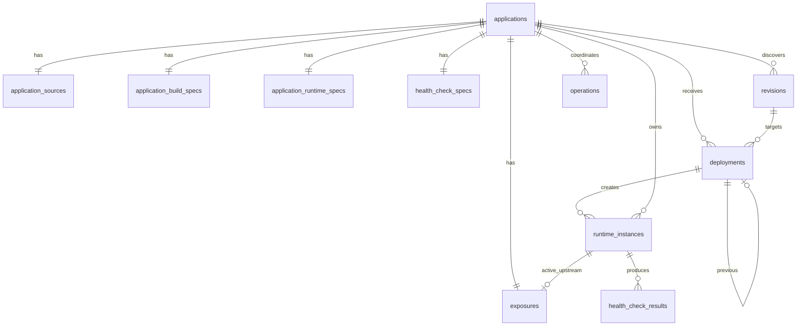

# Modelo de Dados da v0.1 do Pneuma

**Status:** Proposta inicial para migrations  
**Banco:** SQLite  
**Objetivo:** persistir catálogo, intenção, histórico e coordenação sem tratar o banco como fonte exclusiva do estado externo.

Ir implementando cada modelo na medida em que for necessário para a entrega vertical usável em questão. 

## 1. Princípios

- foreign keys habilitadas;
- migrations versionadas e imutáveis após publicação;
- timestamps em UTC no formato definido pela camada de persistência;
- IDs gerados pela aplicação;
- constraints para invariantes que o banco pode garantir;
- transações curtas;
- nenhuma transação aberta durante Git, build, Podman, Caddy ou HTTP;
- dados observados são snapshots com horário;
- erros possuem código estruturado e mensagem;
- configuração privilegiada não é representável;
- schema otimizado para clareza e evolução da v0.1, não para distribuição.

## 2. Visão relacional



## 3. Tabelas

### 3.1 `applications`

Identidade e intenção principal.

| Coluna | Tipo | Regra |
|---|---|---|
| `id` | TEXT | PK |
| `name` | TEXT | NOT NULL, UNIQUE |
| `desired_runtime_state` | TEXT | `running` ou `stopped` |
| `spec_version` | INTEGER | NOT NULL |
| `created_at` | TEXT | NOT NULL |
| `updated_at` | TEXT | NOT NULL |

Não armazena `observed_runtime_state` como verdade. Consultas podem combinar a última observação das instâncias.

### 3.2 `application_sources`

Configuração Git registrada.

| Coluna | Tipo | Regra |
|---|---|---|
| `application_id` | TEXT | PK/FK |
| `repository_location` | TEXT | NOT NULL |
| `repository_kind` | TEXT | `local` ou `remote` |
| `default_branch` | TEXT | NOT NULL |
| `manifest_path` | TEXT | NOT NULL |
| `created_at` | TEXT | NOT NULL |
| `updated_at` | TEXT | NOT NULL |

### 3.3 `application_build_specs`

Contrato de build.

| Coluna | Tipo | Regra |
|---|---|---|
| `application_id` | TEXT | PK/FK |
| `containerfile_path` | TEXT | NOT NULL |
| `context_path` | TEXT | NOT NULL |
| `created_at` | TEXT | NOT NULL |
| `updated_at` | TEXT | NOT NULL |

Paths são relativos ao checkout e validados na camada de domínio.

### 3.4 `application_runtime_specs`

Contrato de execução.

| Coluna | Tipo | Regra |
|---|---|---|
| `application_id` | TEXT | PK/FK |
| `container_port` | INTEGER | 1–65535 |
| `restart_policy` | TEXT | valores suportados |
| `run_as_non_root_required` | INTEGER | `1` na v0.1 |
| `created_at` | TEXT | NOT NULL |
| `updated_at` | TEXT | NOT NULL |

A v0.1 não armazena privileged mode, host mounts ou socket access.

### 3.5 `health_check_specs`

Política de saúde registrada.

| Coluna | Tipo | Regra |
|---|---|---|
| `application_id` | TEXT | PK/FK |
| `path` | TEXT | NOT NULL |
| `expected_status` | INTEGER | 100–599 |
| `timeout_ms` | INTEGER | positivo e limitado |
| `interval_ms` | INTEGER | positivo e limitado |
| `max_attempts` | INTEGER | positivo e limitado |
| `created_at` | TEXT | NOT NULL |
| `updated_at` | TEXT | NOT NULL |

### 3.6 `exposures`

Intenção e última materialização conhecida.

| Coluna | Tipo | Regra |
|---|---|---|
| `application_id` | TEXT | PK/FK |
| `desired_visibility` | TEXT | `internal` ou `public` |
| `domain` | TEXT | NULL quando interna |
| `active_runtime_id` | TEXT | FK nullable |
| `materialization_state` | TEXT | estado conhecido |
| `configuration_version` | TEXT | hash/versão nullable |
| `last_materialized_at` | TEXT | nullable |
| `last_observed_at` | TEXT | nullable |
| `last_error_code` | TEXT | nullable |
| `last_error_message` | TEXT | nullable |
| `created_at` | TEXT | NOT NULL |
| `updated_at` | TEXT | NOT NULL |

Constraints de domínio que envolvem outras tabelas permanecem na aplicação. O banco pode garantir que `public` exige domínio com `CHECK`.

### 3.7 `revisions`

Commits conhecidos por aplicação.

| Coluna | Tipo | Regra |
|---|---|---|
| `id` | TEXT | PK |
| `application_id` | TEXT | FK |
| `commit_sha` | TEXT | NOT NULL |
| `source_reference` | TEXT | entrada original opcional |
| `discovered_at` | TEXT | NOT NULL |

Constraint:

```text
UNIQUE(application_id, commit_sha)
```

### 3.8 `deployments`

Histórico e máquina de estados.

| Coluna | Tipo | Regra |
|---|---|---|
| `id` | TEXT | PK |
| `application_id` | TEXT | FK |
| `revision_id` | TEXT | FK |
| `previous_deployment_id` | TEXT | FK nullable |
| `status` | TEXT | estado da máquina |
| `current_stage` | TEXT | etapa persistida |
| `requested_at` | TEXT | NOT NULL |
| `started_at` | TEXT | nullable |
| `finished_at` | TEXT | nullable |
| `failure_code` | TEXT | nullable |
| `failure_stage` | TEXT | nullable |
| `failure_message` | TEXT | nullable |
| `rollback_result` | TEXT | nullable |
| `created_at` | TEXT | NOT NULL |
| `updated_at` | TEXT | NOT NULL |

Deployment terminal com falha deve possuir código de falha; essa regra pode ser validada na aplicação e, quando viável, por `CHECK`.

### 3.9 `runtime_instances`

Instâncias concretas.

| Coluna | Tipo | Regra |
|---|---|---|
| `id` | TEXT | PK |
| `application_id` | TEXT | FK |
| `revision_id` | TEXT | FK |
| `deployment_id` | TEXT | FK |
| `external_runtime_id` | TEXT | UNIQUE |
| `external_unit_name` | TEXT | nullable |
| `role` | TEXT | `candidate`, `current`, `previous` |
| `host_address` | TEXT | `127.0.0.1` na v0.1 |
| `host_port` | INTEGER | NOT NULL |
| `container_port` | INTEGER | NOT NULL |
| `last_observed_state` | TEXT | snapshot |
| `last_observed_at` | TEXT | nullable |
| `exit_code` | INTEGER | nullable |
| `observation_reason` | TEXT | nullable |
| `created_at` | TEXT | NOT NULL |
| `updated_at` | TEXT | NOT NULL |
| `removed_at` | TEXT | nullable |

Constraints e índices:

```text
UNIQUE(host_address, host_port) WHERE removed_at IS NULL
UNIQUE(application_id) WHERE role = 'current' AND removed_at IS NULL
```

SQLite suporta índices parciais, adequados para essas regras.

### 3.10 `health_check_results`

Resultados relevantes, sem armazenar cada resposta completa.

| Coluna | Tipo | Regra |
|---|---|---|
| `id` | TEXT | PK |
| `application_id` | TEXT | FK |
| `deployment_id` | TEXT | FK nullable |
| `runtime_instance_id` | TEXT | FK |
| `target_kind` | TEXT | `internal` ou `external` |
| `status` | TEXT | resultado |
| `attempts` | INTEGER | NOT NULL |
| `last_http_status` | INTEGER | nullable |
| `failure_code` | TEXT | nullable |
| `failure_message` | TEXT | nullable |
| `started_at` | TEXT | NOT NULL |
| `finished_at` | TEXT | NOT NULL |

A retenção pode manter apenas resultados associados a deployments e diagnósticos recentes.

### 3.11 `operations`

Coordenação genérica e recuperação.

| Coluna | Tipo | Regra |
|---|---|---|
| `id` | TEXT | PK |
| `application_id` | TEXT | FK nullable |
| `kind` | TEXT | tipo de operação |
| `status` | TEXT | estado |
| `current_step` | TEXT | nullable |
| `idempotency_key` | TEXT | nullable |
| `started_at` | TEXT | nullable |
| `finished_at` | TEXT | nullable |
| `error_code` | TEXT | nullable |
| `error_message` | TEXT | nullable |
| `created_at` | TEXT | NOT NULL |
| `updated_at` | TEXT | NOT NULL |

Índice parcial ou constraint para impedir operação conflitante por aplicação pode ser adotado, mas o lock de processo continua necessário.

### 3.12 `schema_migrations`

Mantida pela ferramenta de migrations escolhida.

## 4. DDL inicial ilustrativo

O DDL abaixo é uma proposta de direção, não substitui migrations revisadas.

```sql
PRAGMA foreign_keys = ON;

CREATE TABLE applications (
    id TEXT PRIMARY KEY,
    name TEXT NOT NULL UNIQUE,
    desired_runtime_state TEXT NOT NULL
        CHECK (desired_runtime_state IN ('running', 'stopped')),
    spec_version INTEGER NOT NULL DEFAULT 1,
    created_at TEXT NOT NULL,
    updated_at TEXT NOT NULL
);

CREATE TABLE application_sources (
    application_id TEXT PRIMARY KEY
        REFERENCES applications(id) ON DELETE CASCADE,
    repository_location TEXT NOT NULL,
    repository_kind TEXT NOT NULL
        CHECK (repository_kind IN ('local', 'remote')),
    default_branch TEXT NOT NULL,
    manifest_path TEXT NOT NULL,
    created_at TEXT NOT NULL,
    updated_at TEXT NOT NULL
);

CREATE TABLE application_build_specs (
    application_id TEXT PRIMARY KEY
        REFERENCES applications(id) ON DELETE CASCADE,
    containerfile_path TEXT NOT NULL,
    context_path TEXT NOT NULL,
    created_at TEXT NOT NULL,
    updated_at TEXT NOT NULL
);

CREATE TABLE application_runtime_specs (
    application_id TEXT PRIMARY KEY
        REFERENCES applications(id) ON DELETE CASCADE,
    container_port INTEGER NOT NULL
        CHECK (container_port BETWEEN 1 AND 65535),
    restart_policy TEXT NOT NULL,
    run_as_non_root_required INTEGER NOT NULL DEFAULT 1
        CHECK (run_as_non_root_required = 1),
    created_at TEXT NOT NULL,
    updated_at TEXT NOT NULL
);

CREATE TABLE health_check_specs (
    application_id TEXT PRIMARY KEY
        REFERENCES applications(id) ON DELETE CASCADE,
    path TEXT NOT NULL,
    expected_status INTEGER NOT NULL
        CHECK (expected_status BETWEEN 100 AND 599),
    timeout_ms INTEGER NOT NULL CHECK (timeout_ms > 0),
    interval_ms INTEGER NOT NULL CHECK (interval_ms > 0),
    max_attempts INTEGER NOT NULL CHECK (max_attempts > 0),
    created_at TEXT NOT NULL,
    updated_at TEXT NOT NULL
);

CREATE TABLE revisions (
    id TEXT PRIMARY KEY,
    application_id TEXT NOT NULL
        REFERENCES applications(id) ON DELETE CASCADE,
    commit_sha TEXT NOT NULL,
    source_reference TEXT,
    discovered_at TEXT NOT NULL,
    UNIQUE(application_id, commit_sha)
);

CREATE TABLE deployments (
    id TEXT PRIMARY KEY,
    application_id TEXT NOT NULL
        REFERENCES applications(id) ON DELETE CASCADE,
    revision_id TEXT NOT NULL
        REFERENCES revisions(id),
    previous_deployment_id TEXT
        REFERENCES deployments(id),
    status TEXT NOT NULL,
    current_stage TEXT,
    requested_at TEXT NOT NULL,
    started_at TEXT,
    finished_at TEXT,
    failure_code TEXT,
    failure_stage TEXT,
    failure_message TEXT,
    rollback_result TEXT,
    created_at TEXT NOT NULL,
    updated_at TEXT NOT NULL
);

CREATE TABLE runtime_instances (
    id TEXT PRIMARY KEY,
    application_id TEXT NOT NULL
        REFERENCES applications(id) ON DELETE CASCADE,
    revision_id TEXT NOT NULL
        REFERENCES revisions(id),
    deployment_id TEXT NOT NULL
        REFERENCES deployments(id),
    external_runtime_id TEXT NOT NULL UNIQUE,
    external_unit_name TEXT,
    role TEXT NOT NULL
        CHECK (role IN ('candidate', 'current', 'previous')),
    host_address TEXT NOT NULL DEFAULT '127.0.0.1',
    host_port INTEGER NOT NULL
        CHECK (host_port BETWEEN 1 AND 65535),
    container_port INTEGER NOT NULL
        CHECK (container_port BETWEEN 1 AND 65535),
    last_observed_state TEXT NOT NULL,
    last_observed_at TEXT,
    exit_code INTEGER,
    observation_reason TEXT,
    created_at TEXT NOT NULL,
    updated_at TEXT NOT NULL,
    removed_at TEXT
);

CREATE UNIQUE INDEX one_current_runtime_per_application
ON runtime_instances(application_id)
WHERE role = 'current' AND removed_at IS NULL;

CREATE UNIQUE INDEX active_runtime_endpoint
ON runtime_instances(host_address, host_port)
WHERE removed_at IS NULL;

CREATE TABLE exposures (
    application_id TEXT PRIMARY KEY
        REFERENCES applications(id) ON DELETE CASCADE,
    desired_visibility TEXT NOT NULL
        CHECK (desired_visibility IN ('internal', 'public')),
    domain TEXT,
    active_runtime_id TEXT
        REFERENCES runtime_instances(id),
    materialization_state TEXT NOT NULL,
    configuration_version TEXT,
    last_materialized_at TEXT,
    last_observed_at TEXT,
    last_error_code TEXT,
    last_error_message TEXT,
    created_at TEXT NOT NULL,
    updated_at TEXT NOT NULL,
    CHECK (
        (desired_visibility = 'internal')
        OR
        (desired_visibility = 'public' AND domain IS NOT NULL)
    )
);

CREATE TABLE health_check_results (
    id TEXT PRIMARY KEY,
    application_id TEXT NOT NULL
        REFERENCES applications(id) ON DELETE CASCADE,
    deployment_id TEXT
        REFERENCES deployments(id) ON DELETE SET NULL,
    runtime_instance_id TEXT NOT NULL
        REFERENCES runtime_instances(id) ON DELETE CASCADE,
    target_kind TEXT NOT NULL
        CHECK (target_kind IN ('internal', 'external')),
    status TEXT NOT NULL,
    attempts INTEGER NOT NULL CHECK (attempts > 0),
    last_http_status INTEGER,
    failure_code TEXT,
    failure_message TEXT,
    started_at TEXT NOT NULL,
    finished_at TEXT NOT NULL
);

CREATE TABLE operations (
    id TEXT PRIMARY KEY,
    application_id TEXT
        REFERENCES applications(id) ON DELETE CASCADE,
    kind TEXT NOT NULL,
    status TEXT NOT NULL,
    current_step TEXT,
    idempotency_key TEXT,
    started_at TEXT,
    finished_at TEXT,
    error_code TEXT,
    error_message TEXT,
    created_at TEXT NOT NULL,
    updated_at TEXT NOT NULL
);

CREATE UNIQUE INDEX operation_idempotency
ON operations(idempotency_key)
WHERE idempotency_key IS NOT NULL;
```

## 5. Mapeamento domínio → dados

| Domínio | Persistência |
|---|---|
| Application | `applications` + tabelas de especificação |
| SourceSpec | `application_sources` |
| Revision | `revisions` |
| Deployment | `deployments` |
| RuntimeInstance | `runtime_instances` |
| HealthCheckSpec | `health_check_specs` |
| HealthCheckResult | `health_check_results` |
| Exposure | `exposures` |
| Operation | `operations` |

`Checkout`, `BuiltImage` e observações transitórias podem ser handles de processo. A imagem construída pode ser identificada por convenção e labels no Podman na v0.1; se o histórico exigir mais dados, uma tabela `built_images` poderá ser adicionada por migration.

## 6. Transações por caso de uso

### 6.1 Importação

Uma transação local insere:

- `applications`;
- `application_sources`;
- `application_build_specs`;
- `application_runtime_specs`;
- `health_check_specs`;
- `exposures`.

Nenhum clone remoto longo deve ocorrer dentro da transação. A origem é preparada e validada antes; a persistência final é atômica.

### 6.2 Início de deployment

Transação curta:

- inserir/obter `revision`;
- inserir `deployment(Pending)`;
- inserir `operation`;
- confirmar lock lógico aplicável.

Build e runtime acontecem fora da transação.

### 6.3 Transições

Cada transição usa comparação do estado esperado:

```sql
UPDATE deployments
SET status = ?, current_stage = ?, updated_at = ?
WHERE id = ? AND status = ?;
```

Se nenhuma linha for alterada, ocorreu conflito ou retry.

### 6.4 Promoção da candidata

A promoção precisa ser transacional no banco:

1. rebaixar `Current` anterior para `Previous`;
2. promover candidata para `Current`;
3. atualizar `exposures.active_runtime_id`;
4. marcar deployment `Succeeded`.

Essa transação ocorre somente depois de os efeitos externos obrigatórios terem sido confirmados. Se o commit local falhar, o process manager deve reconciliar com o Caddy e runtime observados.

## 7. Dados observados e divergência

`last_observed_state` é cache com timestamp.

Uma consulta de status pode:

1. carregar aplicação e instâncias;
2. observar runtimes externos;
3. atualizar snapshots;
4. retornar estado composto.

Divergências relevantes:

```text
Desired Running + Observed Stopped
Current registrado + runtime Missing
Public desejado + rota ausente
Internal desejado + rota ainda ativa
Active runtime no Caddy diferente do banco
```

Essas divergências são apresentadas pelo status ou `doctor`.

## 8. Retenção

Política inicial sugerida:

- manter todas as linhas de deployment na v0.1;
- manter health checks associados a deployments;
- manter `Current` e pelo menos um `Previous`;
- marcar runtime removido em vez de apagar imediatamente;
- remover checkouts e imagens por política separada;
- não remover revisão referenciada por deployment;
- manter backups rotacionados fora do banco ativo.

A retenção definitiva será definida após observar volume real.

## 9. Backup e restauração

### Backup

- impedir migration durante backup;
- usar mecanismo consistente do SQLite, não simples cópia com escrita ativa;
- armazenar arquivo em diretório restrito;
- registrar versão do schema;
- verificar integridade do backup.

### Restauração

1. parar operações mutáveis;
2. preservar banco atual;
3. restaurar em path temporário;
4. executar `PRAGMA integrity_check`;
5. validar migrations/schema;
6. substituir atomicamente;
7. executar `pneuma doctor`;
8. comparar estado persistido com runtime e Caddy;
9. não alterar recursos externos automaticamente sem confirmação.

Restauração do banco não significa que o mundo externo voltou ao mesmo estado; reconciliação é obrigatória.

## 10. Migrations

Regras:

- uma migration publicada nunca é editada;
- cada migration é testada de banco vazio até versão atual;
- upgrades a partir da versão anterior são testados;
- mudanças destrutivas exigem backup;
- migrations não executam comandos externos;
- schema version é incluída em diagnóstico e backup.

Sequência inicial possível:

```text
0001_create_application_catalog
0002_create_revisions_and_deployments
0003_create_runtime_instances
0004_create_exposures
0005_create_health_results_and_operations
```

Para o primeiro walking skeleton, somente `0001` precisa existir. As demais entram com os incrementos verticais.

## 11. Índices de consulta

Além dos índices únicos:

```text
deployments(application_id, requested_at DESC)
deployments(application_id, status)
runtime_instances(application_id, role)
runtime_instances(deployment_id)
health_check_results(deployment_id, started_at)
operations(application_id, status)
revisions(application_id, discovered_at DESC)
```

Índices devem ser adicionados conforme consultas reais, sem otimização prematura.

## 12. Questões abertas

- persistir uma tabela `built_images` já na v0.1 ou depender de labels do Podman;
- representar duração como inteiro ou derivar de timestamps;
- usar UUID, ULID ou outro ID ordenável;
- armazenar timestamps como RFC 3339 TEXT ou epoch INTEGER;
- implementar lock lógico em tabela dedicada;
- granularidade de `operations` versus estado do `deployments`;
- retenção de health checks;
- política de soft delete de aplicações.

Essas decisões devem ser resolvidas antes da migration correspondente, não necessariamente antes do primeiro walking skeleton.
