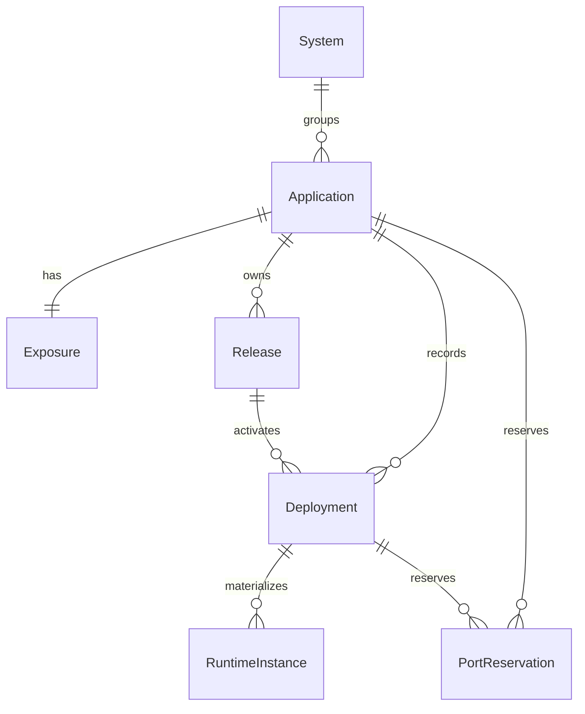

# Pneuma Data Model

**Status:** living document - describes the persisted model as implemented.

Pneuma separates desired intent and deployment history in SQLite from observed
runtime state in Podman/systemd and materialized public routing in Caddy. SQLite
holds logical identities and the last confirmed results; it is not the authority
for whether a container is currently running.

## Model Overview



The database contains exactly eight tables: `schema_migrations`, `systems`,
`applications`, `releases`, `deployments`, `runtime_instances`, `exposures`,
and `runtime_port_reservations`.

Every Application carries exactly one required System, resolved or created at
import from `--system` or `[system].name`; the schema makes a System required.
An Application owns its persisted specification, Releases, and Deployment
history. A Release is an immutable OCI artifact. A Deployment is one attempt to
activate a Release. A RuntimeInstance is the persisted record of the concrete
runtime created by that attempt.

`applications.active_deployment_id` identifies the active successful Deployment.
It is logical identity, not a Podman container ID. A composite foreign key
requires the active Deployment to belong to the same Application, and the
guarded activation write additionally requires it to be `succeeded`.

## Core Entities

### System

`systems` is an optional grouping for Applications.

| Field | Meaning |
|---|---|
| `id` | Stable logical identifier. |
| `name` | Unique system name. |
| `description` | Optional operator description. |

### Application

`applications` stores the durable identity, the immutable imported
specification, and desired runtime intent on one row.

| Field | Meaning |
|---|---|
| `id` | Stable application identifier. |
| `system_id` | Required System relationship; every imported Application resolves or creates exactly one System. |
| `name` | Unique command-facing name. |
| `repository_url` | Validated remote Git source used for branch resolution. |
| `default_branch` | Optional checkout default used when `--branch` is omitted. |
| `manifest_path` | Relative manifest location inside the checkout. |
| `image_repository` | The one OCI repository permitted for this Application's artifacts. |
| `container_port` | Port the container listens on. |
| `health_check_path`, `health_check_expected_status` | Internal health-check contract. |
| `desired_runtime_state` | Operator intent: `running` or `stopped`. |
| `active_deployment_id` | Active successful Deployment, when one exists. |

The core domain `Application` represents durable identity and intent. Catalog
queries return an `ApplicationSummary` that additionally exposes the imported
repository URL and default branch. Deployment flows use named source, delivery,
runtime, and health-check projections rather than positional tuples.

### Release

`releases` represents a reusable immutable OCI artifact for one Application.

| Field | Meaning |
|---|---|
| `id` | Stable Release identifier. |
| `application_id` | Owning Application. |
| `image_reference` | Canonical digest-pinned OCI reference used by Podman. |
| `created_at` | Creation timestamp. |

The unique pair `(application_id, image_reference)` prevents duplicate Releases
for the same artifact. Repository and digest are derived by parsing the
canonical reference; they are never stored or supplied independently. Source
revision belongs to Deployment because the same artifact can be activated by
different requests or branches.

### Deployment

`deployments` records an activation attempt.

| Field | Meaning |
|---|---|
| `id` | Stable Deployment identifier. |
| `application_id` | Target Application. |
| `release_id` | Immutable Release being activated. |
| `type` | `deploy` or `rollback`. |
| `status` | `pending`, `starting`, `verifying`, `activating`, `succeeded`, or `failed`. |
| `source_revision` | Optional Git commit resolved for this attempt. |
| failure fields | Code, stage, and message for a failed attempt. |

`pending`, `starting`, `verifying`, and `activating` are non-terminal. A partial
unique index permits only one non-terminal Deployment per Application. Rollback
creates a new Deployment with type `rollback`; it does not rewrite prior history.

### RuntimeInstance

`runtime_instances` records the runtime materialized for a Deployment.

| Field | Meaning |
|---|---|
| `id` | Stable logical runtime identifier. |
| `application_id` | Owning Application. |
| `deployment_id` | Deployment that created the runtime. |
| `external_runtime_id` | Observed Podman container ID. |
| `state` | Logical runtime state: `starting`, `running`, `stopped`, or `failed`. |
| `host_port` | Reserved loopback port; the address is always `127.0.0.1` and is not persisted. |
| `container_port` | Port exposed inside the container. |
| observation fields | Last Podman observation and diagnostic context. |
| `removed_at` | Intentional retirement timestamp. |

The runtime is externally controlled through a deterministic Quadlet/container
name, `pneuma-<application>-<deployment-id>.container`. The Podman container ID
may change when Quadlet recreates the container; it is not the logical identity.
Retirement is the lifecycle state plus explicit `removed_at` evidence; there is
no persisted `removed` pseudo-state. The domain `RuntimeInstance` carries this
logical identity, endpoint, lifecycle state, last typed external observation,
diagnostics, and retirement evidence; Podman observation remains authoritative
for current external state.

## Application Specification

Import persists the validated `pneuma.toml` specification directly on the
Application row: the remote Git source (`repository_url`, `default_branch`,
`manifest_path`), the permitted OCI repository (`image_repository`), and the
runtime contract (`container_port`, `health_check_path`,
`health_check_expected_status`). The repository URL and manifest path come from
`pneuma app import`; they are not manifest fields. Import clones the repository
temporarily, reads the manifest, persists this specification with the exposure
intent, and removes the checkout.

## Exposure State

`exposures.desired_visibility` is intent: `public` or `internal`.
`materialization_state` is the confirmed state of the corresponding Caddy route:

| State | Meaning |
|---|---|
| `not_materialized` | No public route is expected. |
| `applying` | Public route materialization is in progress. |
| `active` | Caddy route and external health were confirmed. |
| `removing` | Public route removal is in progress. |
| `failed` | A requested route change did not complete. |
| `diverged` | Compensation or observation could not establish a known route state. |

The domain `Exposure` represents this persisted intent, materialization state,
active runtime relationship, configuration version, and diagnostics with typed
visibility and materialization enums.

`active_runtime_id` identifies the RuntimeInstance used for the active public
route. `configuration_version` stores the canonical Caddy fragment content
(domain and loopback endpoint), not a Release or Deployment ID.

Changing visibility to `internal` removes the managed Caddy fragment but leaves
HTTP `404 Not Found` for unmatched hosts. HTTPS can fail before HTTP if Caddy has
no certificate for the former hostname; DNS and certificate lifecycle are
operator-managed.

## Port Reservations

`runtime_port_reservations` temporarily reserves a loopback port for a
candidate. It links the port to its Application and Deployment before the
RuntimeInstance is registered; a Deployment holds at most one reservation, and
repeating allocation for the same Deployment returns its existing reservation.
Registration consumes the exact Application/Deployment/port reservation in the
same transaction as RuntimeInstance insertion; candidate cleanup releases it
idempotently. The primary key on `port` prevents concurrent candidates from
receiving the same endpoint.

## Persistence Invariants

- Every Release, Deployment, RuntimeInstance, Exposure, and port reservation
  agrees with its Application identity through composite foreign keys.
- Only one non-terminal Deployment may exist per Application (partial unique
  index), and terminal rows carry a complete evidence matrix enforced by CHECK
  constraints.
- A live running runtime is unique per Application, and a live loopback
  endpoint is unique while `removed_at` is null.
- An Exposure is one-to-one with an Application; public intent requires a
  domain, one public domain has one owner case-insensitively, and route and
  diagnostic evidence is all-present or all-absent.
- Empty databases initialize atomically with the current baseline schema; a
  database carrying the current `schema_migrations` ledger row reopens
  normally; every other non-empty schema is rejected as incompatible.

## Lifecycle

```text
Import
  -> Application + specification

Deploy
  -> Release (reuse by digest when present)
  -> Deployment (one activation attempt)
  -> RuntimeInstance + reserved loopback endpoint
  -> internal health verification
  -> public Caddy materialization and external health, when desired visibility is public
  -> succeeded Deployment + active_deployment_id
```

Persistence never holds a SQLite transaction during Git, OCI, Podman, systemd,
Caddy, or HTTP work. Use cases persist intent before external effects and persist
confirmed completion afterward. A failed candidate is cleaned up while the prior
active runtime and public route remain intact.

## Related Documents

- [`system-context.md`](system-context.md) explains the scope and vocabulary.
- [`architecture.md`](architecture.md) describes layer responsibilities and
  operational behavior.
- [`security-model.md`](security-model.md) describes trust boundaries.
- [`../decisions/0004-state-authority-and-reconciliation.md`](../decisions/0004-state-authority-and-reconciliation.md)
  explains the authority split.
- [`../getting-started.md`](../getting-started.md) describes manifest authoring,
  import, deployment, and host operation.
