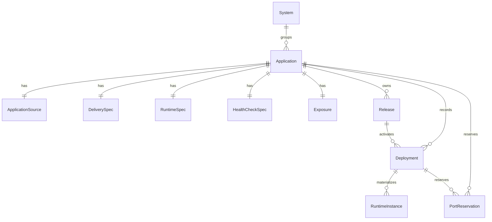

# Pneuma Data Model

**Status:** living document - describes the persisted model as implemented.

Pneuma separates desired intent and deployment history in SQLite from observed
runtime state in Podman/systemd and materialized public routing in Caddy. SQLite
holds logical identities and the last confirmed results; it is not the authority
for whether a container is currently running.

## Model Overview



`system_id` remains nullable for Applications imported before Systems were
introduced. Every newly imported Application resolves or creates exactly one
System from `--system` or `[system].name`. An Application owns its persisted
specification, Releases, and Deployment history. A Release is an immutable OCI
artifact. A Deployment is one attempt to activate a Release. A RuntimeInstance
is the persisted record of the concrete runtime created by that attempt.

`applications.active_deployment_id` identifies the active successful Deployment.
It is logical identity, not a Podman container ID.

## Core Entities

### System

`systems` is an optional grouping for Applications.

| Field | Meaning |
|---|---|
| `id` | Stable logical identifier. |
| `name` | Unique system name. |
| `description` | Optional operator description. |

### Application

`applications` stores the durable identity and desired runtime intent.

| Field | Meaning |
|---|---|
| `id` | Stable application identifier. |
| `system_id` | System relationship for every newly imported Application; nullable only for legacy persisted rows. |
| `name` | Unique command-facing name. |
| `desired_runtime_state` | Operator intent: `running` or `stopped`. |
| `active_deployment_id` | Active successful Deployment, when one exists. |
| `spec_version` | Persisted manifest specification version. |

The core domain `Application` represents durable identity and intent. Catalog
queries return an `ApplicationSummary` that additionally exposes the imported
repository URL and default branch when `application_sources` exists. Deployment
flows use named source, delivery, runtime, and health-check projections rather
than positional tuples.

### Release

`releases` represents a reusable immutable OCI artifact for one Application.

| Field | Meaning |
|---|---|
| `id` | Stable Release identifier. |
| `application_id` | Owning Application. |
| `image_repository` | Allowed OCI repository. |
| `image_digest` | Immutable artifact digest. |
| `image_reference` | Digest-pinned OCI reference used by Podman. |

The unique pair `(application_id, image_digest)` prevents duplicate Releases for
the same artifact. Source revision belongs to Deployment because the same
artifact can be activated by different requests or branches.

### Deployment

`deployments` records an activation attempt.

| Field | Meaning |
|---|---|
| `id` | Stable Deployment identifier. |
| `application_id` | Target Application. |
| `release_id` | Immutable Release being activated. |
| `type` | `deploy` or `rollback`. |
| `status` | `pending`, `starting`, `verifying`, `activating`, `succeeded`, or `failed`. |
| `source_revision` | Optional Git commit resolved for this attempt. |
| failure fields | Code, stage, and message for a failed attempt. |

`pending`, `starting`, `verifying`, and `activating` are non-terminal. A partial
unique index permits only one non-terminal Deployment per Application. Rollback
creates a new Deployment with type `rollback`; it does not rewrite prior history.

### RuntimeInstance

`runtime_instances` records the runtime materialized for a Deployment.

| Field | Meaning |
|---|---|
| `id` | Stable logical runtime identifier. |
| `application_id` | Owning Application. |
| `deployment_id` | Deployment that created the runtime. |
| `external_runtime_id` | Observed Podman container ID. |
| `state` | Logical runtime state: `starting`, `running`, `stopped`, `failed`, or `removed`. |
| `host_address`, `host_port` | Reserved loopback endpoint. |
| `container_port` | Port exposed inside the container. |
| observation fields | Last Podman observation and diagnostic context. |
| `removed_at` | Intentional retirement timestamp. |

The runtime is externally controlled through a deterministic Quadlet/container
name, `pneuma-<application>-<deployment-id>.container`. The Podman container ID
may change when Quadlet recreates the container; it is not the logical identity.

## Application Specification

Import persists the validated `pneuma.toml` specification as one row per
Application in each applicable table.

| Table | Source | Purpose |
|---|---|---|
| `application_sources` | Import command | Git repository URL, repository kind, default branch, and manifest path. |
| `application_delivery_specs` | `[delivery]` | Allowed OCI repository and delivery type. |
| `application_runtime_specs` | `[runtime]` | Container port. |
| `health_check_specs` | `[runtime]` | Internal health-check path and expected status. |
| `exposures` | `[exposure]` | Desired visibility, optional public domain, and route materialization state. |

The repository URL and manifest path come from `pneuma app import`; they are not
manifest fields. Import clones the repository temporarily, reads the manifest,
persists this specification, and removes the checkout.

## Exposure State

`exposures.desired_visibility` is intent: `public` or `internal`.
`materialization_state` is the confirmed state of the corresponding Caddy route:

| State | Meaning |
|---|---|
| `not_materialized` | No public route is expected. |
| `applying` | Public route materialization is in progress. |
| `active` | Caddy route and external health were confirmed. |
| `removing` | Public route removal is in progress. |
| `failed` | A requested route change did not complete. |
| `diverged` | Compensation or observation could not establish a known route state. |

`active_runtime_id` identifies the RuntimeInstance used for the active public
route. `configuration_version` stores the canonical Caddy fragment content
(domain and loopback endpoint), not a Release or Deployment ID.

Changing visibility to `internal` removes the managed Caddy fragment but leaves
HTTP `404 Not Found` for unmatched hosts. HTTPS can fail before HTTP if Caddy has
no certificate for the former hostname; DNS and certificate lifecycle are
operator-managed.

## Port Reservations

`runtime_port_reservations` temporarily reserves a loopback port for a
candidate. It links the port to its Application and Deployment before the
RuntimeInstance is registered. Registration consumes the reservation; candidate
cleanup releases it. The primary key on `port` prevents concurrent candidates
from receiving the same endpoint.

## Persistence Invariants

- Every Release belongs to exactly one Application.
- A database trigger rejects a Deployment whose Release belongs to a different
  Application.
- A database trigger rejects a RuntimeInstance whose Deployment belongs to a
  different Application.
- `(application_id, image_digest)` is unique for Releases.
- Only one non-terminal Deployment may exist per Application.
- A live loopback endpoint is unique while `removed_at` is null.
- An Exposure is one-to-one with an Application; public intent requires a domain.
- Historical migrations are immutable and are applied forward only when a
  connection opens. Downgrading across a migration requires restoring a
  pre-upgrade database backup.

## Lifecycle

```text
Import
  -> Application + specification

Deploy
  -> Release (reuse by digest when present)
  -> Deployment (one activation attempt)
  -> RuntimeInstance + reserved loopback endpoint
  -> internal health verification
  -> public Caddy materialization and external health, when desired visibility is public
  -> succeeded Deployment + active_deployment_id
```

Persistence never holds a SQLite transaction during Git, OCI, Podman, systemd,
Caddy, or HTTP work. Use cases persist intent before external effects and persist
confirmed completion afterward. A failed candidate is cleaned up while the prior
active runtime and public route remain intact.

## Related Documents

- [`system-context.md`](system-context.md) explains the scope and vocabulary.
- [`architecture.md`](architecture.md) describes layer responsibilities and
  operational behavior.
- [`security-model.md`](security-model.md) describes trust boundaries.
- [`../decisions/0004-sqlite-intent-vs-runtime-authority.md`](../decisions/0004-sqlite-intent-vs-runtime-authority.md)
  explains the authority split.
- [`../design/reconciliation.md`](../design/reconciliation.md) defines future
  v0.4 reconciliation semantics.
- [`../getting-started.md`](../getting-started.md) describes manifest authoring,
  import, deployment, and host operation.
