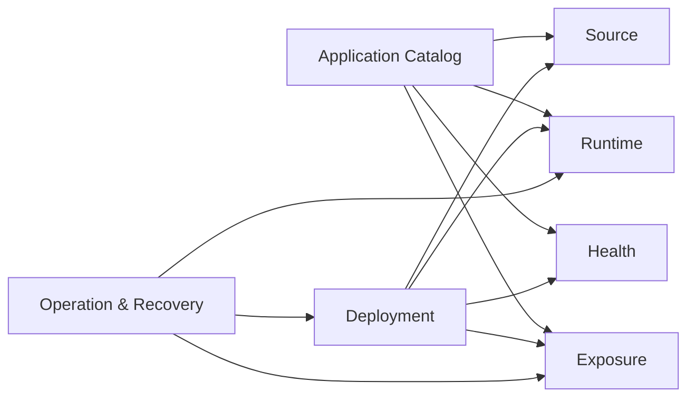
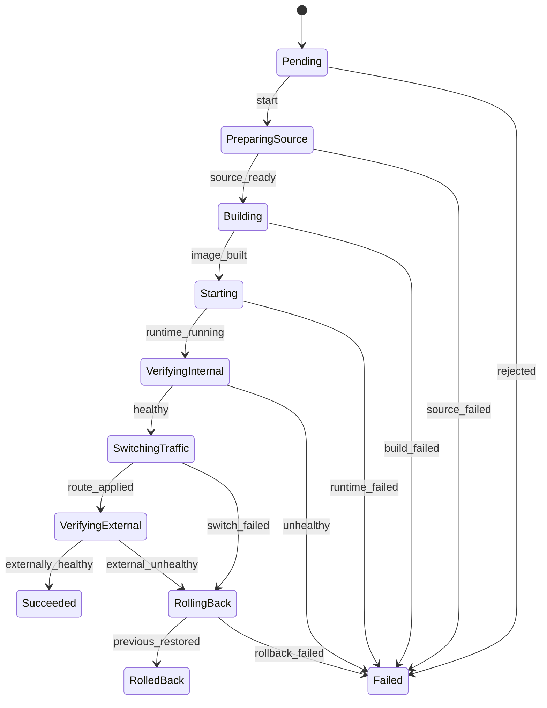
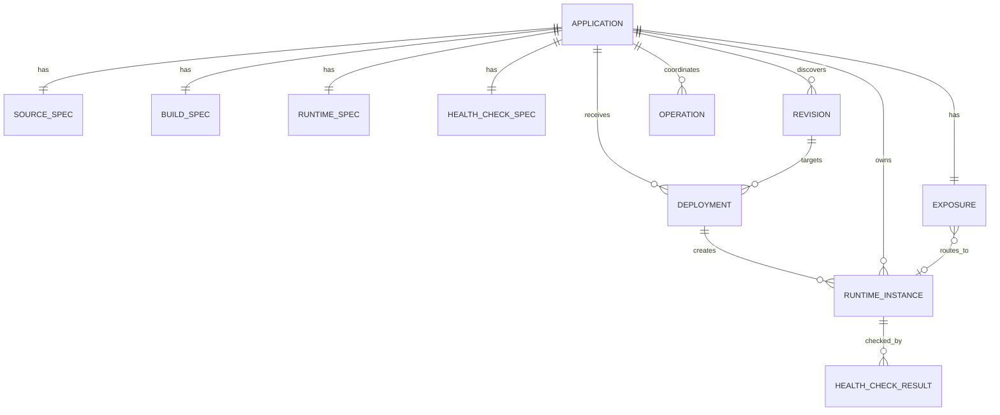

# Modelo de Domínio da v0.1 do Pneuma

**Status:** Hipótese de domínio da Iteração D0  
**Objetivo:** definir linguagem, responsabilidades, estados e invariantes sem acoplamento a Git, Podman, SQLite ou Caddy.

## 1. Princípios de modelagem

1. domínios representam capacidades e regras, não tabelas ou comandos externos;
2. nem todo campo precisa de um tipo próprio;
3. value objects são usados quando existe validação, identidade semântica ou comportamento;
4. estado observado não é inferido do estado desejado;
5. uma revisão, um deployment e um runtime são conceitos distintos;
6. exposição é independente do lifecycle da aplicação;
7. operações longas são processos persistidos;
8. os limites são lógicos; nem todo domínio precisa ser uma crate ou bounded context separado.

## 2. Linguagem ubíqua

| Termo | Significado |
|---|---|
| Application | aplicação registrada e administrada pelo Pneuma |
| Application Specification | configuração validada usada para build, runtime, health e exposição |
| Source | origem Git da aplicação |
| Revision | commit Git imutável selecionado para build |
| Checkout | cópia isolada de uma revisão |
| Built Image | imagem local produzida a partir de uma revisão |
| Deployment | tentativa auditável de tornar uma revisão ativa |
| Runtime Instance | execução concreta de uma revisão no host |
| Candidate | runtime em avaliação, sem ser a versão ativa |
| Current | runtime ativo e elegível a receber tráfego |
| Previous | runtime anterior mantido para rollback |
| Desired Runtime State | intenção `Running` ou `Stopped` |
| Observed Runtime State | estado lido do runtime real |
| Exposure | decisão de tornar a aplicação interna ou pública |
| Materialized Route | configuração efetivamente aplicada no Caddy |
| Health Check | política de verificação da aplicação |
| Operation | coordenação persistida de uma ação longa ou recuperável |
| Rollback | restauração de uma revisão ou rota anteriormente saudável |
| Reconciliation | comparação sob demanda entre estado desejado e observado |

## 3. Mapa dos domínios



## 4. Application Catalog

### 4.1 Responsabilidade

Representar a aplicação conhecida pelo Pneuma e sua configuração desejada.

### 4.2 Aggregate root: `Application`

Propriedades conceituais:

```text
id
name
source_spec
build_spec
runtime_spec
health_check_spec
desired_runtime_state
desired_exposure
created_at
updated_at
```

`Application` não contém estado observado do Podman como verdade de domínio. A última observação pode aparecer em projeções de consulta.

### 4.3 Value objects úteis

Use tipos próprios apenas onde existe regra relevante:

- `ApplicationId`: identidade estável;
- `ApplicationName`: nome normalizado e validado;
- `ContainerPort`: intervalo válido;
- `RelativeProjectPath`: path relativo que não escapa da raiz;
- `DomainName`: domínio sintaticamente válido e permitido;
- `RepositoryLocation`: URL ou path suportado.

Campos como `expected_status` ou `default_branch` podem permanecer tipos primitivos validados pela especificação, até que comportamento adicional justifique value object.

### 4.4 Invariantes

- `ApplicationName` é único no catálogo;
- o nome normalizado é seguro para labels e nomes derivados;
- a origem precisa ser suportada;
- caminhos de build são relativos ao checkout;
- a porta do container é válida;
- exposição pública exige domínio;
- `desired_runtime_state` é explícito;
- importação repetida da mesma identidade não cria nova aplicação;
- configuração privilegiada não é representável na v0.1.

### 4.5 Comandos de domínio

```text
register
change_desired_runtime_state
change_desired_exposure
update_registered_specification
```

Atualizar especificação deve ser uma operação explícita; realizar deploy de outro commit não altera silenciosamente a configuração registrada.

## 5. Source

### 5.1 Responsabilidade

Representar origem e revisão imutável sem executar comandos Git no domínio.

### 5.2 Entidades e valores

#### `SourceSpec`

```text
repository_location
default_branch
manifest_path
```

#### `Revision`

```text
commit_sha
application_id
discovered_at
```

Uma `Revision` é um commit completo resolvido. Branch ou tag são apenas referências de entrada.

#### `Checkout`

É um handle produzido pelo adapter, usado durante build. Não precisa ser persistido como entidade de domínio permanente.

### 5.3 Invariantes

- commit SHA é completo e imutável;
- revisão pertence à origem da aplicação;
- uma combinação aplicação + commit identifica uma revisão;
- checkout fica fora do domínio persistente;
- revisão não implica que o build foi concluído;
- revisão não implica que existe runtime.

## 6. Deployment

### 6.1 Responsabilidade

Representar uma tentativa de ativar uma revisão, incluindo estados, resultado e relação com a versão anterior.

### 6.2 Aggregate root: `Deployment`

```text
id
application_id
revision_id
previous_deployment_id
status
requested_at
started_at
finished_at
failure
```

### 6.3 Estados

```text
Pending
PreparingSource
Building
Starting
VerifyingInternal
SwitchingTraffic
VerifyingExternal
Succeeded
Failed
RollingBack
RolledBack
```

### 6.4 Máquina de estados



Para aplicação interna, `SwitchingTraffic` e `VerifyingExternal` podem ser concluídos sem rota pública, mantendo o mesmo modelo de processo.

### 6.5 Invariantes

- deployment pertence a uma aplicação e uma revisão;
- apenas estados permitidos podem ser alcançados;
- estado terminal não volta para estado em andamento;
- `Succeeded` exige candidata promovida e verificações obrigatórias concluídas;
- `Failed` exige `Failure`;
- `RolledBack` indica que a revisão alvo não ficou ativa;
- deployment não altera a revisão anterior antes de confirmar a candidata;
- somente um deployment não terminal por aplicação;
- rollback é registrado como nova tentativa ou operação relacionada, não como alteração silenciosa do histórico.

### 6.6 Failure

```text
code
stage
message
recoverability
occurred_at
```

A mensagem é diagnóstico; regras não devem depender de texto livre.

## 7. Runtime

### 7.1 Responsabilidade

Representar instâncias concretas e a separação entre intenção e observação.

### 7.2 Entity: `RuntimeInstance`

```text
id
application_id
revision_id
deployment_id
external_runtime_id
role
endpoint
last_observation
created_at
```

### 7.3 `RuntimeRole`

```text
Candidate
Current
Previous
```

### 7.4 `DesiredRuntimeState`

```text
Running
Stopped
```

Pertence à aplicação.

### 7.5 `ObservedRuntimeState`

```text
NotCreated
Created
Starting
Running
Stopping
Stopped
Failed
Missing
Unknown
```

É produzido por observação externa.

### 7.6 `RuntimeObservation`

```text
state
observed_at
exit_code
reason
```

### 7.7 Invariantes

- uma instância pertence a uma aplicação e revisão;
- `external_runtime_id` é referência externa, não identidade de domínio;
- somente uma instância pode ser `Current`;
- candidata não recebe rota pública antes da verificação;
- `Previous` não é automaticamente removida enquanto elegível a rollback;
- o papel não substitui o estado observado;
- promover candidata requer `Running` e health check interno bem-sucedido;
- parar a aplicação altera intenção e coordena runtime; não remove automaticamente a decisão de exposição;
- endpoint deve ser loopback e exclusivo entre instâncias ativas.

## 8. Health

### 8.1 Responsabilidade

Representar política e resultado de saúde de forma mais rica que um booleano.

### 8.2 `HealthCheckSpec`

```text
path
expected_status
timeout
interval
max_attempts
```

### 8.3 `HealthTarget`

```text
Internal(endpoint)
External(url)
```

### 8.4 `HealthCheckResult`

```text
status
attempts
started_at
finished_at
last_response_status
failure
```

### 8.5 `HealthStatus`

```text
Healthy
Unhealthy
TimedOut
Unreachable
InvalidResponse
```

### 8.6 Invariantes

- path é relativo à origem HTTP;
- timeout e tentativas são positivos e limitados;
- resultado terminal contém informação suficiente para diagnóstico;
- sucesso interno é obrigatório antes da ativação;
- sucesso externo é obrigatório quando a aplicação é pública;
- health check não modifica diretamente runtime ou exposição; o process manager decide.

## 9. Exposure

### 9.1 Responsabilidade

Representar intenção de acessibilidade e rota materializada.

### 9.2 Aggregate root: `Exposure`

```text
application_id
desired_visibility
domain
active_runtime_id
materialization
updated_at
```

### 9.3 `Visibility`

```text
Internal
Public
```

### 9.4 `MaterializationState`

```text
NotMaterialized
Applying
Active
Removing
Diverged
Failed
```

### 9.5 `MaterializedRoute`

```text
domain
upstream_endpoint
configuration_version
applied_at
```

### 9.6 Invariantes

- `Public` exige domínio;
- `Internal` não possui rota pública ativa;
- somente um upstream ativo por domínio;
- `active_runtime_id` deve apontar para `Current`;
- exposição e execução são independentes;
- remover exposição não altera `DesiredRuntimeState`;
- nova rota só substitui a anterior após validação;
- falha de materialização não deve apagar a última rota válida conhecida;
- o estado materializado deve poder divergir e ser diagnosticado.

## 10. Operation e Recovery

### 10.1 Responsabilidade

Coordenar ações que cruzam banco e sistemas externos.

Não é necessário expor `Operation` como conceito de usuário em todas as telas, mas o sistema precisa persistir ações longas e locks lógicos.

### 10.2 `Operation`

```text
id
application_id
kind
status
current_step
started_at
updated_at
finished_at
error
```

### 10.3 `OperationKind`

```text
Import
Deploy
Start
Stop
ChangeExposure
Rollback
Cleanup
Backup
Restore
```

### 10.4 `OperationStatus`

```text
Pending
Running
Succeeded
Failed
Interrupted
```

### 10.5 Invariantes

- uma operação mutável conflitante por aplicação;
- etapa atual é persistida antes ou depois dos efeitos conforme protocolo;
- estado terminal é imutável;
- operação interrompida precisa ser classificável;
- erro de operação não substitui o estado detalhado do deployment;
- IDs são usados para idempotência e correlação.

Na implementação inicial, `Deployment` pode atuar como process manager para deployment, enquanto `Operation` atende ações genéricas.

## 11. Relações



Esse diagrama mostra relações conceituais. O schema físico pode usar estruturas diferentes.

## 12. Casos de uso e agregados

| Caso de uso | Agregados principais | Ports |
|---|---|---|
| ImportApplication | Application | SourceControl, ManifestLoader, ApplicationStore |
| DeployRevision | Deployment, RuntimeInstance, Exposure | SourceControl, ImageBuilder, RuntimeControl, HealthProbe, ExposureControl |
| StartApplication | Application, RuntimeInstance | RuntimeControl |
| StopApplication | Application, RuntimeInstance | RuntimeControl |
| ChangeExposure | Exposure, RuntimeInstance | ExposureControl, HealthProbe |
| RollbackDeployment | Deployment, RuntimeInstance, Exposure | RuntimeControl, ExposureControl, HealthProbe |
| GetApplicationStatus | Application + projeções | Stores, RuntimeControl, ExposureControl |
| RecoverInterruptedOperations | Deployment, Operation, RuntimeInstance, Exposure | todos os adapters observáveis |

## 13. Domain events internos

Eventos podem ser usados em memória para desacoplar efeitos, sem event bus externo:

```text
ApplicationImported
RevisionResolved
DeploymentStarted
ImageBuilt
RuntimeCandidateStarted
InternalHealthCheckPassed
TrafficSwitched
DeploymentSucceeded
DeploymentFailed
RollbackStarted
RollbackCompleted
ExposureChanged
RuntimeDivergenceDetected
```

Na v0.1, persistir eventos como event sourcing não é necessário. O histórico relacional é suficiente.

## 14. Erros de domínio

Categorias:

```text
ValidationError
ConflictError
InvalidStateTransition
InvariantViolation
NotFound
OperationAlreadyInProgress
NoHealthyRollbackTarget
ExposureConflict
```

Erros externos são traduzidos para erros de aplicação com código, etapa e causa.

## 15. Decisões deliberadamente adiadas

- `Release` por digest OCI;
- serviços e projetos compostos;
- redes internas;
- secrets;
- políticas de autorização;
- múltiplos hosts;
- reconciliação contínua;
- event sourcing;
- filas;
- daemon;
- API web.

Esses conceitos não devem aparecer como campos vazios ou abstrações prematuras na v0.1.
