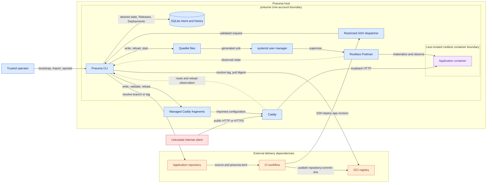

# Pneuma System Context

**Status:** living document - describes the problem, constraints, and scope that
shape the implemented system.

## Problem

Running one container on a VPS is simple. Replacing it safely while knowing which
artifact is active, validating it before traffic changes, preserving a healthy
version after failure, recovering after reboot, and reproducing host setup is the
operational problem Pneuma addresses.

Without Pneuma, a small operator typically builds an image in CI, logs into the
host, pulls it, chooses a port, stops and starts containers, edits a reverse
proxy, checks health, and reconstructs rollback state manually. Pneuma makes
those steps controlled, durable, and inspectable without introducing a
Kubernetes-class control plane.

## Intended Environment

Pneuma is for a technically competent individual or very small team operating a
small set of containerized applications on one Linux host. The host uses systemd,
rootless Podman, Caddy, SQLite, Git repositories for application configuration,
and an OCI registry. CI already produces the deployable artifact.

The architecture favors a small single-host installation over horizontal
scheduling, fleet coordination, multi-tenant workloads, distributed
control-plane availability, or cluster consensus.

## Goals

1. **Applications survive Pneuma.** The CLI can exit after deployment; systemd
   owns long-lived runtime supervision.
2. **Deploy immutable artifacts.** Production activation uses a digest-pinned
   OCI image with a stable identity.
3. **Preserve a healthy version.** A candidate must pass health checks before it
   replaces the active runtime and route.
4. **Separate desired and observed state.** SQLite records intent and history;
   Podman/systemd and Caddy report external reality.
5. **Keep host privileges narrow.** Containers run rootlessly and CI receives a
   restricted deployment interface rather than an interactive shell.
6. **Make operations reproducible.** Bootstrap, diagnostics, backup/restore,
   and disposable-VM validation make host operation repeatable.
7. **Keep the platform simpler than the workloads.** Pneuma has no resident
   daemon or distributed controller at this stage.

## Non-goals

- **Kubernetes replacement:** Pneuma intentionally does not solve cluster
  scheduling or multi-host operation.
- **General container orchestrator:** it models Pneuma applications and their
  deployment semantics, not arbitrary containers.
- **Build system:** CI builds application artifacts; builds on the deployment
  host would couple application toolchains to host operation.
- **Full CI/CD platform:** Pneuma selects and activates artifacts but does not
  replace CI workflow execution.
- **Service mesh or autoscaling platform:** topology, policy, workload identity,
  and scaling have separate future roadmap scope.
- **PaaS for untrusted tenants:** rootless containers reduce privilege but do not
  provide hostile multi-tenant isolation.
- **Hosted SaaS control plane:** all state and effects are local to one host.

## Constraints

1. One Linux host is the deployment target.
2. The host uses systemd and rootless Podman.
3. Applications are OCI-compatible artifacts.
4. Git identifies the imported application configuration and resolves requested
   branch or tag revisions.
5. CI produces images tagged with the full commit SHA.
6. Runtimes must not require a resident Pneuma process.
7. Host-side Caddy is the public ingress boundary; application ports remain on
   loopback.

## System Context

Solid arrows represent commands, data, or materialization effects. Dashed arrows
represent observation. Blue components are trusted host controls; orange
components are trusted external delivery dependencies; red is untrusted public
traffic; purple is the less-trusted Application workload.

The repository supplies an import-time specification. CI publishes an image
whose tag equals the resolved full commit SHA. Pneuma resolves that tag to an OCI
digest and activates the digest-pinned image. SQLite holds logical intent and
history; external systems own their observable state.

## Vocabulary

| Term | Meaning |
|---|---|
| Application | Durable command-facing identity, imported specification, desired runtime state, Releases, and Deployment history. |
| System | Optional organizational grouping for Applications. |
| Manifest | Validated `pneuma.toml` import-time specification for delivery, runtime, health, and exposure. |
| Release | Reusable immutable OCI artifact for one Application, identified by digest. |
| Deployment | One attempt to activate a Release. |
| Candidate | Runtime materialized for a pending Deployment before promotion. |
| RuntimeInstance | Logical record of the concrete runtime created by a Deployment. Its Podman container ID can change. |
| Exposure | Desired visibility plus the confirmed Caddy route materialization state. |
| Desired state | Operator intent persisted in SQLite. |
| Observed state | Current external state reported by Podman/systemd or Caddy. |
| Materialization | Creating or confirming external runtime or route resources from persisted intent. |
| Promotion | Transactionally recording a healthy Deployment and runtime as active. |
| Retirement | Intentional removal of a prior or failed runtime; it records `removed_at`. |
| Reconciliation | Future convergence of observed materialization toward unambiguous persisted intent. |
| Drift | Difference between expected materialization and observed runtime or route state. |
| Dispatcher | The forced-command CI interface that parses a restricted SSH request. |

Release is not Deployment: one Release can have several activation attempts.
Deployment is not RuntimeInstance: a Deployment creates a logical runtime whose
external container ID can change. Desired state is not observed state, and public
visibility is independent from whether a runtime is running.

## Related Documents

- [`architecture.md`](architecture.md) describes implemented behavior.
- [`data-model.md`](data-model.md) describes persisted entities and invariants.
- [`security-model.md`](security-model.md) describes trust boundaries.
- [`../decisions/`](../decisions/) explains the rationale for major choices.
