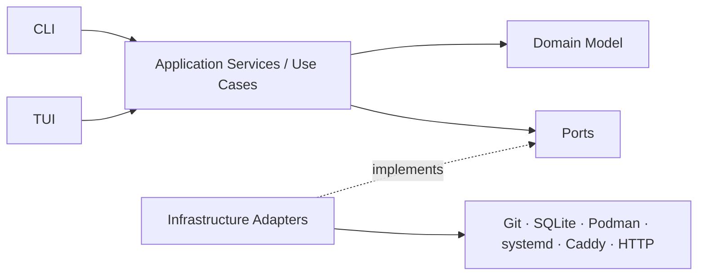
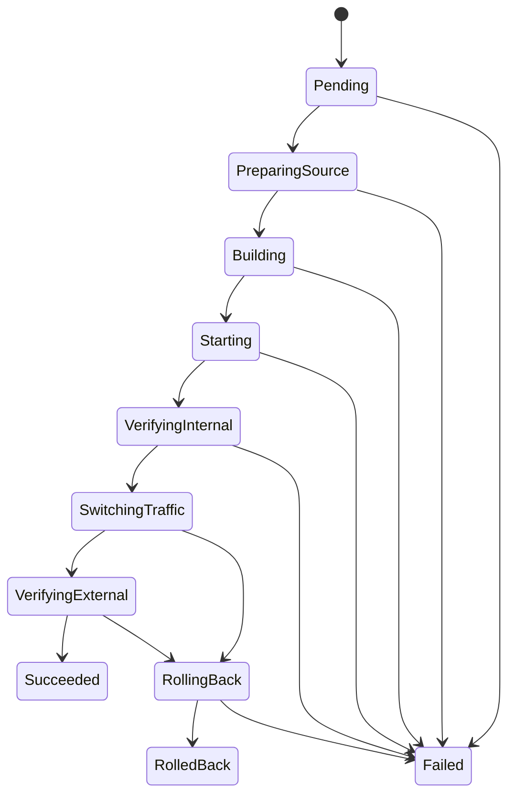

# Arquitetura da v0.1 do Pneuma

> **Arquivado:** hipótese original da Iteração D0, preservada como registro. A arquitetura implementada está em [`docs/architecture/architecture.md`](../architecture/architecture.md).

**Status:** Hipótese arquitetural da Iteração D0  
**Estilo:** monólito modular com ports and adapters  
**Escopo:** um único host Linux e aplicações de um container

## 1. Drivers arquiteturais

A arquitetura é orientada pelos seguintes requisitos:

1. uma aplicação saudável não pode depender da vida do processo da CLI ou TUI;
2. uma revisão inválida não pode substituir a atual;
3. estado desejado e observado devem ser separados;
4. operações devem ser idempotentes e recuperáveis;
5. CLI e TUI devem reutilizar os mesmos casos de uso;
6. o projeto precisa permanecer pequeno o suficiente para evoluir em incrementos;
7. o código de domínio não pode ser modelado ao redor de comandos externos;
8. a segurança do host deve limitar o poder da aplicação e do usuário operacional;
9. a v0.1 precisa preparar a transição para imagens OCI por digest sem implementá-la.

## 2. Decisão estrutural

A v0.1 será um **monólito modular local**.

- não haverá microserviços;
- não haverá daemon obrigatório;
- CLI e TUI comporão o Core no processo local;
- aplicações serão supervisionadas pelo host;
- operações mutáveis utilizarão locking local;
- o banco persistirá processos longos;
- adapters encapsularão integrações externas.



As dependências apontam para dentro:

```text
interfaces → application/use cases → domain
infrastructure adapters → application ports
domain → nenhuma tecnologia externa
```

## 3. Processo e concorrência

### 3.1 Modelo de processo

Na v0.1, cada comando CLI ou sessão TUI cria:

- configuração;
- conexão SQLite;
- casos de uso;
- adapters;
- logger;
- gerenciador de locks.

O processo termina quando a interface termina. Os containers continuam supervisionados pelo host.

### 3.2 Locks

São necessários dois níveis lógicos:

- **lock por aplicação:** impede deployments ou alterações conflitantes simultâneas;
- **lock global de exposição:** serializa materialização e reload do Caddy.

A implementação exata será escolhida após spike. A hipótese é combinar:

- lock de arquivo no host para exclusão entre processos;
- registro persistido da operação para crash recovery;
- constraints no SQLite como defesa adicional.

Locks não devem ser mantidos durante espera indefinida. Toda operação externa deve possuir timeout.

## 4. Componentes lógicos

### 4.1 Interfaces

#### CLI

Responsável por:

- parsing de argumentos;
- composição das dependências;
- apresentação de resultados;
- códigos de saída;
- modo não interativo futuro.

Não contém lógica de domínio.

#### TUI

Responsável por:

- navegação;
- apresentação de estado;
- coleta de comandos;
- atualização de progresso.

Não chama Git, Podman, Caddy ou SQLite diretamente.

### 4.2 Application layer

Contém os casos de uso e process managers:

- `ImportApplication`;
- `ListApplications`;
- `GetApplicationStatus`;
- `DeployRevision`;
- `StartApplication`;
- `StopApplication`;
- `ChangeExposure`;
- `RollbackDeployment`;
- `RecoverInterruptedOperations`;
- `RunDiagnostics`.

Responsabilidades:

- coordenar agregados;
- obter locks;
- abrir transações locais;
- chamar ports;
- persistir transições;
- mapear falhas externas em erros da aplicação;
- produzir resultados para interfaces.

### 4.3 Domain layer

Contém:

- entidades;
- agregados;
- estados;
- invariantes;
- value objects com regra real;
- transições;
- erros de domínio.

Não contém:

- SQL;
- comandos de processo;
- tipos do Podman;
- paths concretos;
- parsing de CLI;
- widgets da TUI;
- HTTP client.

### 4.4 Infrastructure layer

Adapters previstos:

| Adapter | Responsabilidade |
|---|---|
| SQLite repositories | persistir agregados, projeções e operações |
| Git source control | clone/fetch, resolução e checkout isolado |
| Podman image builder | construir e inspecionar imagens |
| Podman runtime | criar, iniciar, parar, remover e inspecionar containers |
| systemd supervisor | materializar/ativar supervisão e observar unidades |
| Caddy exposure | gerar, validar, trocar e restaurar fragmentos |
| HTTP health checker | executar verificações internas e externas |
| Filesystem workspace | diretórios, arquivos atômicos e limpeza |
| Clock/ID generator | tempo e IDs testáveis |
| Operation lock | exclusão entre processos |

## 5. Organização física sugerida

Os limites lógicos não exigem uma crate por adapter desde o primeiro commit.

Estrutura inicial recomendada:

```text
pneuma/
├── Cargo.toml
├── crates/
│   ├── pneuma-core/
│   │   └── src/
│   │       ├── domain/
│   │       │   ├── catalog/
│   │       │   ├── source/
│   │       │   ├── deployment/
│   │       │   ├── runtime/
│   │       │   ├── exposure/
│   │       │   └── health/
│   │       ├── application/
│   │       └── ports/
│   ├── pneuma-infrastructure/
│   │   └── src/
│   │       ├── sqlite/
│   │       ├── git/
│   │       ├── podman/
│   │       ├── systemd/
│   │       ├── caddy/
│   │       ├── health_http/
│   │       └── filesystem/
│   ├── pneuma-cli/
│   └── pneuma-tui/
├── migrations/
├── docs/
└── tests/
```

Adapters podem ser extraídos para crates próprias quando:

- dependências se tornarem pesadas ou conflitantes;
- testes e releases independentes trouxerem benefício;
- o limite físico reduzir complexidade;
- existir reutilização concreta.

A organização por domínio no Core é mais importante que criar muitos pacotes.

## 6. Ports

Os ports devem expressar capacidades necessárias pelos casos de uso.

Exemplo conceitual:

```rust
trait ApplicationStore {
    fn insert(&self, application: &Application) -> Result<(), StoreError>;
    fn find(&self, id: ApplicationId) -> Result<Option<Application>, StoreError>;
    fn find_by_name(&self, name: &str) -> Result<Option<Application>, StoreError>;
}

trait SourceControl {
    fn prepare_repository(&self, source: &SourceSpec) -> Result<RepositoryHandle, SourceError>;
    fn resolve_revision(
        &self,
        repository: &RepositoryHandle,
        reference: &str,
    ) -> Result<Revision, SourceError>;
    fn create_checkout(
        &self,
        repository: &RepositoryHandle,
        revision: &Revision,
    ) -> Result<Checkout, SourceError>;
}

trait ImageBuilder {
    fn build(
        &self,
        application: &Application,
        revision: &Revision,
        checkout: &Checkout,
    ) -> Result<BuiltImage, BuildError>;
}

trait RuntimeControl {
    fn create(&self, spec: &RuntimeLaunchSpec) -> Result<ExternalRuntime, RuntimeError>;
    fn start(&self, runtime: &ExternalRuntime) -> Result<(), RuntimeError>;
    fn stop(&self, runtime: &ExternalRuntime) -> Result<(), RuntimeError>;
    fn remove(&self, runtime: &ExternalRuntime) -> Result<(), RuntimeError>;
    fn observe(&self, runtime: &ExternalRuntime) -> Result<RuntimeObservation, RuntimeError>;
}

trait ExposureControl {
    fn validate(&self, desired: &DesiredRoute) -> Result<(), ExposureError>;
    fn apply(&self, desired: &DesiredRoute) -> Result<MaterializedRoute, ExposureError>;
    fn restore(&self, previous: &MaterializedRoute) -> Result<(), ExposureError>;
    fn observe(&self, application: ApplicationId) -> Result<ExposureObservation, ExposureError>;
}

trait HealthProbe {
    fn probe(&self, target: &HealthTarget, spec: &HealthCheckSpec)
        -> Result<HealthCheckResult, HealthError>;
}
```

Essas assinaturas são ilustrativas. Devem ser refinadas a partir dos casos de uso e testes, sem espelhar diretamente CLIs externas.

## 7. Runtime e supervisão

### 7.1 Modelo

Cada revisão implantada pode gerar uma `RuntimeInstance` com papel:

- `Candidate`;
- `Current`;
- `Previous`.

Cada instância usa endpoint loopback próprio:

```text
127.0.0.1:<host_port> → <container_port>
```

O endpoint não é público. O Caddy aponta somente para a instância ativa.

### 7.2 Alocação de porta

Hipótese da v0.1:

- reservar intervalo configurado no host;
- persistir alocação por instância;
- verificar disponibilidade antes da criação;
- não reutilizar porta de instância ainda registrada;
- liberar durante limpeza concluída.

A política exata deve ser validada por spike.

### 7.3 Supervisão

O desenho preferido é Podman rootless com Quadlet/systemd user units.

O Core trabalha com abstrações de runtime e supervisor. Se o spike indicar que Quadlet cria complexidade desproporcional, uma alternativa pode ser adotada por ADR sem mudar o domínio.

## 8. Deployment seguro

### 8.1 Máquina de estados



Na v0.1, `RolledBack` significa que a nova revisão não foi entregue e a anterior voltou ou permaneceu ativa.

### 8.2 Sequência de sucesso

1. obter lock da aplicação;
2. validar pré-condições;
3. criar `Deployment(Pending)`;
4. resolver commit;
5. criar checkout;
6. persistir estado `Building`;
7. construir imagem;
8. alocar porta e criar `Candidate`;
9. iniciar supervisão;
10. observar runtime;
11. executar health check interno;
12. preparar configuração de exposição;
13. validar Caddy;
14. trocar upstream;
15. executar health check externo quando pública;
16. promover candidata para `Current`;
17. rebaixar a anterior para `Previous`;
18. concluir deployment;
19. limpar conforme política;
20. liberar lock.

### 8.3 Sequência de falha antes da troca

- marcar deployment como `Failed`;
- parar/remover candidata;
- preservar `Current`;
- preservar Caddy;
- reter logs necessários;
- liberar lock.

### 8.4 Sequência de falha depois da troca

- marcar `RollingBack`;
- restaurar fragmento anterior;
- recarregar Caddy;
- verificar endpoint anterior;
- remover candidata;
- marcar `RolledBack` ou `Failed` se a recuperação não puder ser confirmada;
- emitir diagnóstico crítico.

## 9. Consistência e transações

Não existe transação única entre:

```text
SQLite ↔ Git ↔ filesystem ↔ Podman ↔ systemd ↔ Caddy ↔ HTTP
```

A estratégia é uma **saga local persistida**, executada por um process manager.

### 9.1 Regras

- persistir intenção antes de efeitos importantes;
- persistir conclusão depois de confirmar o efeito;
- operações externas precisam ser idempotentes ou detectáveis;
- cada recurso externo recebe nome/label derivado de IDs persistidos;
- compensações são explícitas;
- um estado intermediário nunca é escondido;
- recuperação compara estado persistido e observado.

### 9.2 Crash recovery

Ao iniciar uma operação, o Pneuma consulta deployments não terminais.

Exemplos:

| Persistido | Observado | Ação |
|---|---|---|
| `Building` | imagem ausente, processo inexistente | marcar `Failed: Interrupted` |
| `Starting` | candidata `Running` | continuar verificação ou solicitar recuperação |
| `VerifyingInternal` | candidata saudável | continuar fluxo |
| `SwitchingTraffic` | Caddy ainda aponta para anterior | retomar troca ou rollback seguro |
| `VerifyingExternal` | Caddy aponta para candidata | verificar e concluir/rollback |
| `RollingBack` | rota anterior restaurada | concluir `RolledBack` |

A política detalhada deve ser documentada em `failure-model.md` ou ADR antes da Iteração 3.

## 10. Persistência

SQLite armazena estado transacional local e histórico.

Princípios:

- foreign keys habilitadas;
- migrations versionadas;
- timestamps UTC;
- IDs gerados pela aplicação;
- constraints para invariantes persistentes;
- transações curtas;
- nenhuma transação aberta durante build, HTTP ou comandos externos;
- última observação é cache, não verdade absoluta;
- backup consistente antes de migration destrutiva futura.

O schema está descrito em [`data-model.md`](./data-model.md).

## 11. Exposição pelo Caddy

### 11.1 Propriedade

O Pneuma administra apenas fragmentos dentro de uma raiz dedicada, por exemplo:

```text
<managed-caddy-dir>/<application-id>.caddy
```

O `Caddyfile` principal importa essa raiz.

### 11.2 Atualização

1. gerar conteúdo em memória;
2. escrever arquivo temporário na mesma filesystem;
3. validar configuração completa;
4. renomear atomicamente;
5. solicitar reload;
6. observar configuração;
7. executar health check externo;
8. manter backup do fragmento anterior até confirmação.

### 11.3 Privilégio

O mecanismo exato será escolhido por spike. Opções aceitáveis:

- diretório gravável pelo usuário do Pneuma e lido pelo Caddy;
- helper restrito;
- comando `sudo` com argumentos fixos;
- socket/admin API local com controle adequado.

A v0.1 não concede acesso root geral ao Pneuma.

## 12. Segurança

### 12.1 Repositório e build

- repositório é entrada não confiável;
- comandos não passam por shell;
- checkout fica em raiz controlada;
- paths do manifesto devem ser relativos e normalizados;
- symlinks que escapam da raiz são rejeitados;
- contexto de build é limitado;
- modo privilegiado e host mounts são proibidos;
- aplicação não recebe acesso ao Podman.

### 12.2 Runtime

- rootless;
- usuário não root na imagem;
- somente bind de porta em loopback;
- sem exposição direta em `0.0.0.0`;
- nomes e labels determinísticos;
- recursos identificáveis para diagnóstico.

### 12.3 Dados

- banco e backups com permissão restrita;
- logs sem secrets;
- arquivo de manifesto não contém credenciais;
- nenhuma credencial de registry é necessária na v0.1.

## 13. Observabilidade

Usar `tracing` desde o início.

Campos mínimos:

```text
application_id
application_name
deployment_id
operation_id
revision
runtime_id
operation
state
duration_ms
result
error_code
```

Níveis:

- `INFO`: início e conclusão de operações;
- `WARN`: divergência recuperável;
- `ERROR`: falha de operação ou compensação;
- `DEBUG`: detalhes técnicos não sensíveis.

O histórico persistido complementa, mas não substitui, os logs.

## 14. Testes

### 14.1 Domínio

- transições;
- invariantes;
- idempotência;
- seleção da revisão anterior;
- promoção de candidata;
- regras de exposição.

### 14.2 Casos de uso

Com fakes:

- sequências de sucesso;
- falha em cada etapa;
- compensações;
- crash recovery;
- locks.

### 14.3 Adapters

- SQLite real;
- repositório Git temporário;
- Podman em ambiente descartável;
- Caddy com configuração de teste;
- HTTP server de teste;
- filesystem temporário.

### 14.4 E2E

- revisão saudável A;
- revisão saudável B;
- revisão inválida C;
- troca pública;
- rollback;
- restart;
- divergência manual;
- backup/restore;
- migração em domínio temporário.

## 15. Instalação e operação

Estrutura conceitual:

```text
/opt/pneuma/                     binários/versionamento, se administrado pelo sistema
/var/lib/pneuma/                 dados persistentes
/var/lib/pneuma/database/
/var/lib/pneuma/repositories/
/var/lib/pneuma/checkouts/
/var/lib/pneuma/generated/
/var/lib/pneuma/backups/
/var/log/pneuma/                 caso não use somente journal
/etc/pneuma/                     configuração do Pneuma
/etc/caddy/applications/         fragmentos gerenciados
```

Para modo rootless, paths podem estar sob o home do usuário dedicado. A escolha final deve considerar permissões do host e ser registrada em ADR.

## 16. Evolução para v0.2 e v0.3

A arquitetura prepara:

- substituir `BuildRevision` por descoberta de `Release`;
- adicionar adapter de registry;
- usar digest OCI;
- manter `Deployment`, `Runtime`, `Exposure` e health checks;
- executar CLI não interativa via SSH;
- introduzir daemon/API somente quando houver necessidade real.

O domínio não deve tratar uma revisão Git como sinônimo permanente de artefato. Na v0.1 ela é a unidade implantável; na v0.2 uma `Release` poderá encapsular revisão e digest.

## 17. Riscos e validações pendentes

| Risco | Tratamento |
|---|---|
| Quadlet rootless não atender lifecycle esperado | spike e ADR |
| reload do Caddy exigir privilégio excessivo | spike de permissões |
| conflito entre processos CLI/TUI | spike de locks |
| alocação de portas causar colisão | estratégia persistida e teste |
| recuperação pós-crash ficar ambígua | failure model antes do deployment |
| schema ficar acoplado ao Podman | persistir IDs externos como referência, não como domínio |
| excesso de crates atrasar o projeto | começar com limites lógicos e poucas crates |
