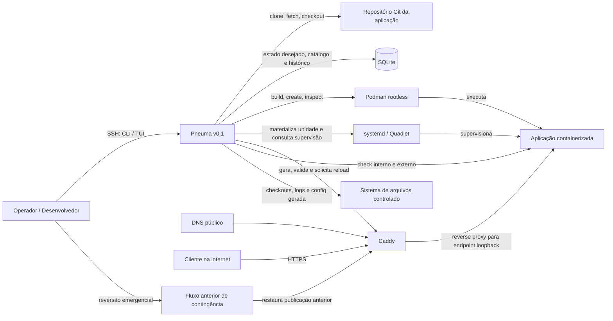
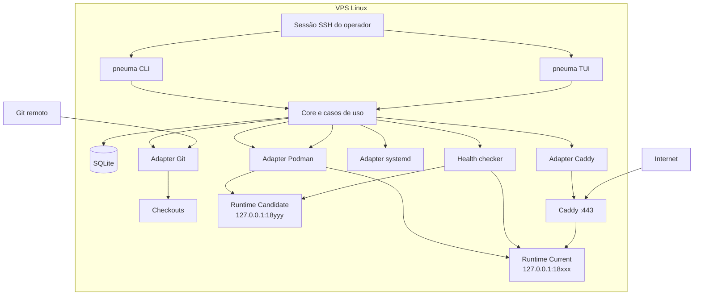
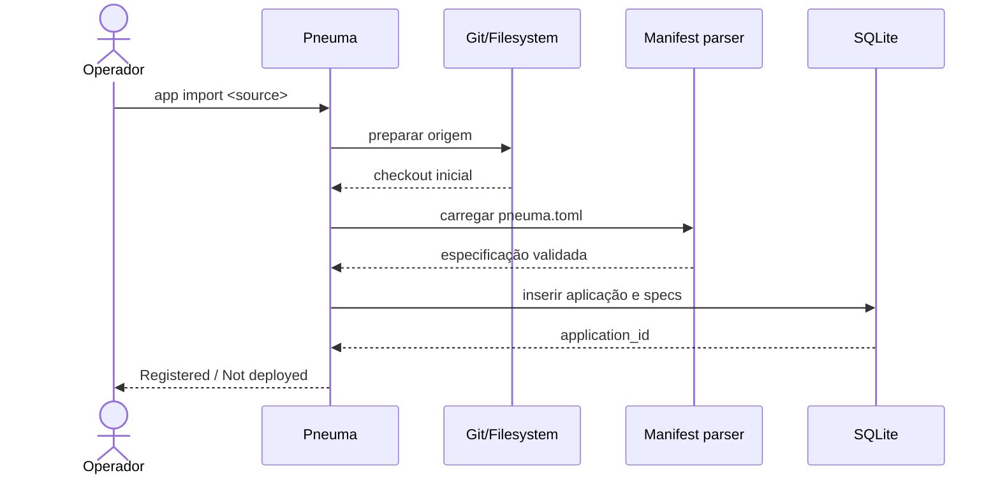
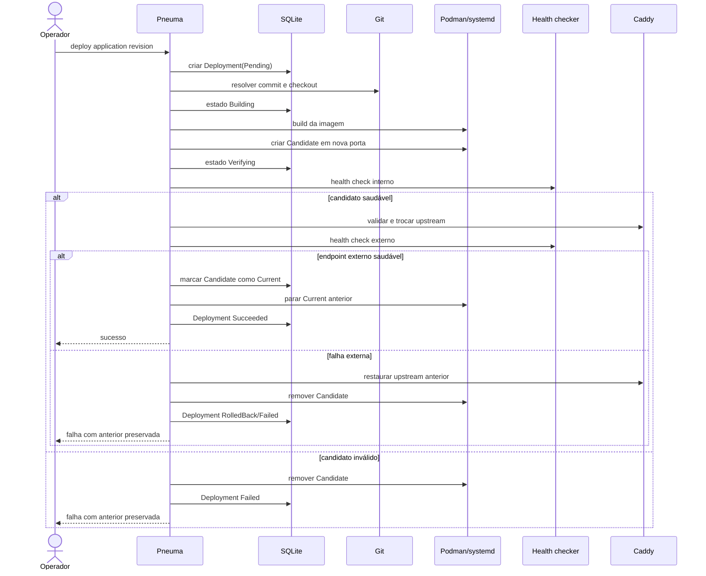

# Contexto do Sistema — Pneuma v0.1

> **Arquivado:** hipótese original da Iteração D0, preservada como registro. A arquitetura implementada está em [`docs/architecture/architecture.md`](../architecture/architecture.md).

**Status:** Hipótese de design da Iteração D0  
**Nível:** contexto e fronteiras externas  
**Documentos relacionados:** [`architecture-d0.md`](./architecture-d0.md), [`domain-model.md`](./domain-model.md)

## 1. Visão

O Pneuma é um control plane local para registrar, implantar e operar aplicações containerizadas em um único servidor Linux.

Na v0.1, ele é utilizado pelo próprio administrador da VPS por SSH. O sistema coordena Git, Podman, systemd, SQLite, Caddy e health checks, mas não substitui essas tecnologias.

## 2. Fronteira do sistema

Dentro da fronteira do Pneuma estão:

- casos de uso;
- regras de domínio;
- coordenação de deployments;
- persistência do estado desejado e histórico;
- interfaces CLI e TUI;
- adapters para sistemas externos;
- geração de configuração controlada.

Fora da fronteira estão:

- repositório Git;
- engine e storage de imagens do Podman;
- systemd;
- Caddy;
- DNS;
- aplicação executada;
- sistema de arquivos do host;
- operador humano;
- fluxo anterior de contingência.

## 3. Diagrama de contexto

## 4. Atores

### 4.1 Operador e desenvolvedor

Responsabilidades:

- preparar o repositório compatível;
- executar CLI ou TUI;
- selecionar a revisão;
- iniciar deployments;
- decidir exposição;
- interpretar falhas;
- executar contingência quando necessário.

O operador já está autenticado pelo acesso SSH ao host. A v0.1 não introduz autenticação própria.

### 4.2 Cliente externo

É qualquer navegador ou cliente que acessa o site público. Não interage diretamente com o Pneuma.

## 5. Sistemas externos

### 5.1 Repositório Git

Fornece:

- código-fonte;
- histórico;
- commit imutável;
- `Containerfile`;
- `pneuma.toml`.

O Pneuma não altera o repositório remoto na v0.1.

### 5.2 Podman rootless

Responsável por:

- build da imagem;
- criação de containers;
- lifecycle imediato;
- inspeção do estado;
- logs do runtime;
- isolamento básico.

O Podman é fonte de verdade para o estado imediato do container.

### 5.3 systemd e Quadlet

Responsáveis por:

- supervisão do processo;
- reinício conforme política;
- inicialização após boot;
- estado do serviço no host.

A forma exata de integração deve ser validada pelo spike. O domínio do Pneuma não depende de Quadlet diretamente.

### 5.4 Caddy

Responsável por:

- TLS;
- terminação HTTP;
- reverse proxy;
- exposição pública.

O Pneuma mantém a decisão de exposição e materializa um fragmento de configuração controlado. O Caddy continua sendo fonte de verdade operacional sobre a configuração carregada.

### 5.5 SQLite

Armazena:

- catálogo de aplicações;
- configuração registrada;
- revisões conhecidas;
- deployments;
- instâncias;
- exposição desejada;
- operações e histórico.

O SQLite não é fonte de verdade para o estado observado dos processos.

### 5.6 Sistema de arquivos

Armazena:

- checkouts isolados;
- banco e backups;
- logs controlados;
- configuração gerada;
- arquivos temporários;
- metadados de instalação.

Todos os caminhos devem permanecer dentro de raízes administradas pelo Pneuma.

### 5.7 DNS

Direciona o domínio para a VPS. O gerenciamento de DNS está fora da v0.1.

### 5.8 Fluxo anterior de contingência

É o mecanismo manual ou configuração anterior capaz de restaurar o site quando o Pneuma estiver indisponível.

Ele deve permanecer documentado e testado durante a adoção da v0.1.

## 6. Cenário de implantação no host

Na v0.1 não existe obrigatoriamente um daemon central. Cada execução da CLI ou TUI compõe o Core e os adapters no processo local. Operações mutáveis devem obter locks antes de alterar estado.

## 7. Interações principais

| Interação | Origem | Destino | Dados |
|---|---|---|---|
| Importar aplicação | Operador | Pneuma | URL/path do repositório |
| Resolver revisão | Pneuma | Git | branch, tag ou SHA de entrada |
| Persistir catálogo | Pneuma | SQLite | aplicação e especificações |
| Construir imagem | Pneuma | Podman | checkout e build spec |
| Criar runtime | Pneuma | Podman/systemd | imagem, porta e política |
| Observar runtime | Pneuma | Podman/systemd | identificador externo |
| Verificar saúde | Pneuma | Aplicação | HTTP local/externo |
| Publicar rota | Pneuma | Caddy | domínio e upstream |
| Consultar status | Operador | Pneuma | nome/ID da aplicação |
| Restaurar contingência | Operador | Fluxo anterior | configuração manual |

## 8. Fontes de verdade

| Informação | Fonte de verdade | Cópia ou projeção |
|---|---|---|
| Código de uma revisão | Git commit | checkout local |
| Manifesto importado | registro no SQLite após validação | arquivo no repositório |
| Estado desejado do runtime | SQLite | TUI/CLI |
| Estado observado do container | Podman/systemd | última observação no SQLite |
| Deployment ativo | SQLite após ativação confirmada | papel do runtime |
| Endpoint local | runtime + alocação persistida | configuração do Caddy |
| Exposição desejada | SQLite | TUI/CLI |
| Configuração materializada | arquivo e estado carregado no Caddy | hash/estado no SQLite |
| Saúde atual | resultado do health check | último resultado persistido |
| Domínio e DNS | configuração externa | manifesto/registro |

## 9. Trust boundaries

### TB-1 — Entrada do operador

Mesmo sendo operador confiável, argumentos e paths devem ser validados para evitar erros destrutivos.

### TB-2 — Repositório importado

O repositório é conteúdo potencialmente hostil. `Containerfile`, symlinks e caminhos não recebem confiança implícita.

### TB-3 — Container

A aplicação é isolada do host. Não recebe modo privilegiado, mounts arbitrários ou socket do Podman.

### TB-4 — Alteração do Caddy

A passagem de configuração gerada para o Caddy cruza uma fronteira de privilégio e precisa ser mínima, validada e auditável.

### TB-5 — Internet

Somente o Caddy é exposto publicamente. Runtime, SQLite, CLI, TUI e interfaces internas não devem ficar acessíveis pela internet.

## 10. Fluxos de contexto

### 10.1 Importação

### 10.2 Deployment

## 11. Eventos externos fora de controle

O design deve considerar:

- repositório indisponível;
- perda de rede durante fetch;
- falta de espaço;
- Podman indisponível;
- reboot do host;
- Caddy inválido ou indisponível;
- DNS ainda apontando para configuração anterior;
- container removido manualmente;
- banco restaurado para snapshot antigo.

Esses eventos não são evitados pelo Pneuma; devem ser detectados e diagnosticados.

## 12. Decisões não tomadas neste documento

Este documento não decide:

- schema SQL detalhado;
- assinatura final das traits;
- crates físicos;
- biblioteca Rust de SQLite;
- biblioteca HTTP;
- formato visual da TUI;
- política final de retenção;
- mecanismo exato de elevação mínima para reload do Caddy.

Essas decisões pertencem à arquitetura detalhada, ADRs ou spikes.
